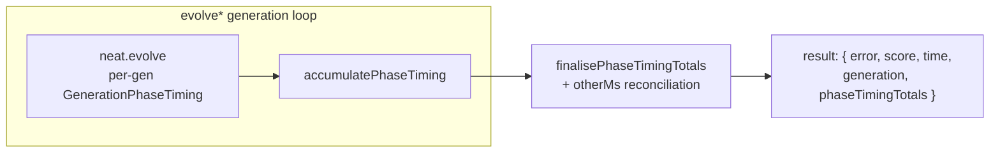

# Return per-phase timing totals in evolve() results

## Summary

The `evolve*` functions previously returned only a single total `time` in ms.
This PR additionally returns `phaseTimingTotals` — a whole-run breakdown of
where that time went across the major phases (fitness/scoring, breeding,
mutation, de-duplication, speciation, sort, write-scores, checkpoint writes),
plus an `otherMs` reconciliation bucket. A production run can now confirm that
scanning gigabytes of training data (fitness/scoring) dominates, and spot any
phase worth tuning, **without** wiring up an `onTrainingEvent` listener.

The per-generation `GenerationPhaseTiming` breakdown is already recorded by
`neat.evolve()` on every generation (Issues #2239/#2274/#2284) and streamed on
each `generation_complete` event. This change simply **sums** those always-on
measurements across the whole run — no new instrumentation — so the added
overhead is effectively zero, matching the expectation in the issue.

The new field is additive: it appears on `evolveDir`, `evolveDataSet`,
`evolveEnv` and `evolveRL` alongside the existing `error`, `score`, `time` (and
`generation`). All values are raw milliseconds; percentages are the caller's to
derive.

Closes #3210.

### Design notes

- **Major phases only** — no breeding sub-phase totals (per the accepted scope).
- **`otherMs`** captures wall-clock not attributed to a named phase (worker
  start-up, population seeding, finish-up waits, the final checkpoint write, and
  any phase overlap) so the buckets reconcile with the run total:
  `fitnessMs + breedingMs + mutationMs + deduplicationMs + speciationMs +
  sortMs + writeScoresMs + checkpointWriteMs + otherMs === totalMs`.
  It is clamped at 0 (matching the existing `nonFitnessMs` convention) so
  pipelined/overlapping phases never yield a negative bucket.
- **`generations`** is the number of aggregated generations; **`totalMs`**
  equals the returned `time`.

## Evidence

Backend/library change only — no web interface to screenshot. Verified via new
unit and integration tests (below) and the full `./quality.sh` gate.

`./quality.sh` result: **7439 passed, 1 failed, 4 ignored**. The single failure
— `Neuron discovery: collectRustAnalysisCandidates returns analysis bundle` (an
unhandled Rust `setBias` variant in `DiscoverAnalysis.ts`) — is **pre-existing
and unrelated** to this change: it fails identically on a clean checkout
(`git stash` → run → still fails) and touches no phase-timing code.

## Test Plan

- `test/creature/PhaseTimingTotals_test.ts` (new) — unit tests for the
  accumulator/finaliser:
  - empty accumulator finalises to zeros;
  - sums the major phases across generations;
  - optional per-generation phases default to zero when absent;
  - named buckets plus `otherMs` reconcile to `totalMs`;
  - `otherMs` clamps at 0 when overlapping phases exceed wall-clock.
- `test/creature/EvolvePhaseTimingTotals.ts` (new) — integration test:
  `evolveDataSet` returns `phaseTimingTotals` whose `generations` matches the
  number of `generation_complete` events, whose `totalMs` equals the returned
  `time`, whose `fitnessMs` equals the summed per-generation fitness timings,
  and whose buckets reconcile with `totalMs`.
