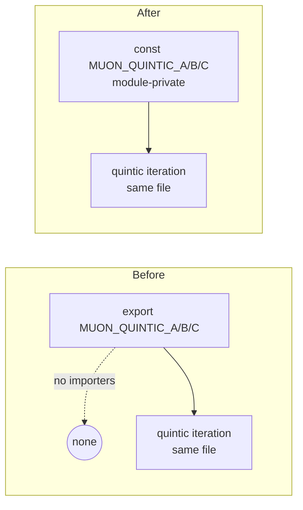

## Summary

Removed the redundant `export` keyword from the three Muon quintic
Newton-Schulz coefficients — `MUON_QUINTIC_A`, `MUON_QUINTIC_B` and
`MUON_QUINTIC_C` — in `src/propagate/MuonOrthogonalisation.ts`. Graph analysis
confirmed no other module in the repository (`src/**`, `test/**`, `bench/**`,
`mod.ts`) imports these symbols; they are used only internally by the quintic
iteration in their defining file. Narrowing them to module-private constants
removes dead public surface without changing any behaviour. Closes #3211.

Verification performed before the change:

- `grep -rn "MUON_QUINTIC_[ABC]"` across `src`, `test`, `bench`, `mod.ts`,
  `docs` — the only references are the definitions and the internal uses at
  lines 191, 198 and 204 of the same file.
- No `export *` barrels exist under `src/` or `mod.ts` that could re-export
  them implicitly.
- `src/propagate/MuonGradientHook.ts` (the only cross-module importer of this
  file) imports `newtonSchulzOrthogonalise` and `RowMajorMatrix` only.
- No dynamic import or string-keyed access to the constants exists.

## Evidence

Backend/library change only — no web interface to screenshot.

The genuinely-public API of the module (`newtonSchulzOrthogonalise`,
`orthogonalise2D`, `frobeniusNorm`, `MUON_DEFAULT_STEPS`, `RowMajorMatrix`)
is unchanged; only the three internal coefficients stop being exported.

The existing behaviour tests still exercise the constants through
`newtonSchulzOrthogonalise` (decorrelation, gramian bounds, idempotence,
edge cases), so correctness of the quintic iteration remains covered.

## Test Plan

- Added `test/propagate/MuonOrthogonalisation.ts::"Muon - quintic coefficients
  are not part of the public export surface"` — a regression guard that
  dynamically imports the module and asserts the three coefficients are **not**
  in its export keys, while the intended public API remains exported. Confirmed
  this test fails when the `export` keyword is present and passes once the
  constants are module-private.
- All 20 tests in `test/propagate/MuonOrthogonalisation.ts` pass.
- Full `./quality.sh` run: 7440 passed. The single unrelated failure
  (`NeuronDiscoveryIntegration.ts::collectRustAnalysisCandidates` — a
  Rust-coordinated `setWeight` variant mapping) is pre-existing on the
  `milestone/dead-code` base branch and independent of this change (verified by
  re-running it with these changes stashed).
