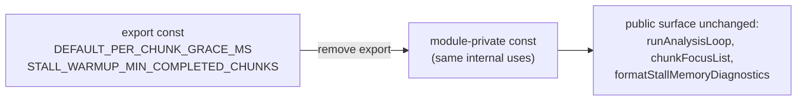

## Summary

Removed the redundant `export` keyword from the two stall-detection tuning
constants — `DEFAULT_PER_CHUNK_GRACE_MS` and `STALL_WARMUP_MIN_COMPLETED_CHUNKS`
— in `src/architecture/ErrorGuidedStructuralEvolution/DataRecorderAnalysis.ts`.
Graph analysis confirmed no other module in the repository (`src/**`, `test/**`,
`bench/**`, `mod.ts`, `docs/**`) imports these symbols; they are consumed only
internally by the per-chunk timeout and stall-warmup logic in their defining
file. Narrowing them to module-private constants removes dead public surface
without changing any behaviour. Closes #3212.

Verification performed before the change:

- `grep -rn "DEFAULT_PER_CHUNK_GRACE_MS\|STALL_WARMUP_MIN_COMPLETED_CHUNKS"`
  across `src`, `test`, `bench`, `mod.ts`, `docs` — the only references are the
  definitions and the internal uses (`:458,485,616,741,760,770`) plus a
  `{@link}` doc reference at `:121`, all within the same file.
- The three test files that import from `DataRecorderAnalysis.ts`
  (`DiscoverAnalysisStallWarmup.ts`, `DiscoverAnalysisChunking.ts`,
  `DiscoverAnalysisPerChunkTimeout.ts`) import only `runAnalysisLoop`,
  `chunkFocusList`, `formatStallMemoryDiagnostics` and `ParallelAnalysisFn` —
  never the two constants.
- No `export *` barrels exist under `src/` or `mod.ts`, and the module is not
  re-exported from `mod.ts`.
- No dynamic import or string-keyed access to the constants exists.
- The `{@link DEFAULT_PER_CHUNK_GRACE_MS}` doc reference resolves fine for a
  module-private symbol.

## Evidence

Backend/library change only — no web interface to screenshot. Verified via the
new runtime test that inspects the module namespace object.

## Test Plan

- Added `test/ErrorGuidedStructuralEvolution/DataRecorderAnalysisExports.ts`:
  - `stall tuning constants are not over-exported` — dynamically imports the
    module and asserts `DEFAULT_PER_CHUNK_GRACE_MS` and
    `STALL_WARMUP_MIN_COMPLETED_CHUNKS` are `undefined` on the module namespace.
    Fails against the unfixed code (constants exported → `1000` / `2`) and
    passes after removing `export`.
  - `genuine public surface stays exported` — asserts `runAnalysisLoop`,
    `chunkFocusList` and `formatStallMemoryDiagnostics` remain callable
    functions.
- Existing `DataRecorderAnalysis.ts` consumers (stall-warmup, chunking and
  per-chunk-timeout suites) continue to pass unchanged.

> Note: the pre-existing failure in
> `test/ErrorGuidedStructuralEvolution/NeuronDiscoveryIntegration.ts`
> ("Unhandled variant: setWeight") is unrelated to this change — it fails on the
> base branch without these edits and stems from a Rust coordinated-op variant
> not handled in `DiscoverAnalysis.ts`.
