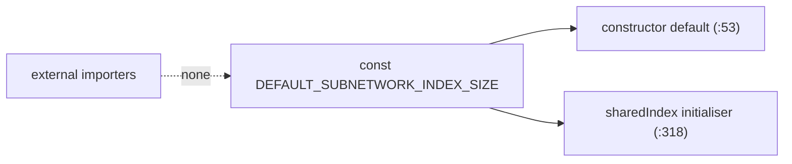

# Make `DEFAULT_SUBNETWORK_INDEX_SIZE` module-private (Issue #3215)

## Summary

The default-capacity constant `DEFAULT_SUBNETWORK_INDEX_SIZE` was `export`ed
from `src/discovery/SubnetworkHashIndex.ts` but no other module in the
repository imports it. A token scan across `src/**`, `test/**`, `bench/**` and
`mod.ts` finds zero importers outside the defining file — the constant is used
only internally, as the constructor default (line 53) and the shared-index
initialiser (line 318). This change drops the `export` keyword to keep the
symbol module-private, removing dead public surface area. Behaviour is
unchanged. Closes #3215.

## Evidence

Backend-only change with no web interface, so no screenshot applies.

Verified there are no importers before removing the export:

```
$ grep -rn "DEFAULT_SUBNETWORK_INDEX_SIZE" src test bench mod.ts
src/discovery/SubnetworkHashIndex.ts:30:const DEFAULT_SUBNETWORK_INDEX_SIZE = 50_000;
src/discovery/SubnetworkHashIndex.ts:53:  constructor(maxEntries: number = DEFAULT_SUBNETWORK_INDEX_SIZE) {
src/discovery/SubnetworkHashIndex.ts:318:  DEFAULT_SUBNETWORK_INDEX_SIZE,
```

Both remaining references are internal to the defining file. The module is not
re-exported from `mod.ts` and the repo contains no `export *` barrels, so
dropping `export` cannot break any external consumer.



## Test Plan

- No test imported the constant, so no test needed updating.
- The existing behavioural guard
  `test/discovery/SubnetworkHashIndex.ts` →
  `"SubnetworkHashIndex - default size 50,000 and isEnabled() reflects size"`
  constructs `new SubnetworkHashIndex()` with no arguments and asserts the
  index is enabled. It exercises the default-constructor behaviour that the
  constant backs, without depending on the exported symbol, and continues to
  pass after the change.
- `deno test test/discovery/SubnetworkHashIndex.ts` — 19 passed / 0 failed.
- `deno check src/discovery/SubnetworkHashIndex.ts` — clean.
- Full `./quality.sh` passes lint, format and type-check. One unrelated test
  (`NeuronDiscoveryIntegration.ts` → `collectRustAnalysisCandidates returns
  analysis bundle`) fails on both this branch and the untouched base branch —
  a pre-existing Rust-dylib `setWeight` variant mismatch with no connection to
  this one-line export change.
