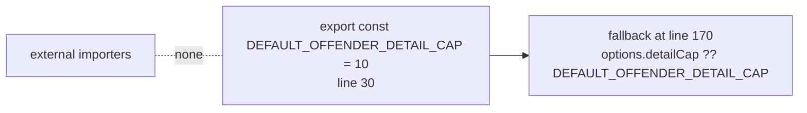

# Remove unused export `DEFAULT_OFFENDER_DETAIL_CAP` (Issue #3216)

## Summary

The diagnostics cap constant `DEFAULT_OFFENDER_DETAIL_CAP` in
`src/score/BatchScorerDiagnostics.ts` was exported but had no importer anywhere
in `src/`, `test/`, `bench/`, or `mod.ts`. Its only use is internal — the
fallback for `options.detailCap` inside `buildBatchScorerDiagnostic`. Dropped
the `export` keyword so the constant is module-private, removing the dead export
while keeping behaviour identical.

`BatchScorerDiagnostics.ts` is not re-exported from `mod.ts` and the repository
has no `export *` barrels, so narrowing the visibility cannot break any external
consumer. A token scan confirmed the only two references are the definition
(line 30) and the internal fallback use (line 170), both in the defining file.

Closes #3216.

## Evidence

Backend-only change — no web interface to screenshot. Verified via the existing
behavioural test that exercises the default cap through the public API
(`buildBatchScorerDiagnostic`), plus lint/format/type-check:

- `deno test test/score/BatchScorerDiagnostics.ts` → **11 passed, 0 failed**,
  including `... caps detail at 10 with +N more suffix`, which asserts the
  default cap of 10 is applied when `detailCap` is omitted (i.e. the value the
  constant supplies) — a "what" test that survives the visibility change.
- `./quality.sh --check-only` → exit 0 (type-check across the tree).
- `./quality.sh --lint-only` → exit 0 (1753 files linted, `deno fmt` clean, bash
  scripts clean).

Reference (unused-export before removal):

## Test Plan

No new test required — the existing
`test/score/BatchScorerDiagnostics.ts::"... caps detail at 10 with +N more suffix"`
already guards the default-cap-of-10 behaviour through the public API without
importing the constant, so it remains the safety net for this change. All 11
tests in that file pass after the edit.
