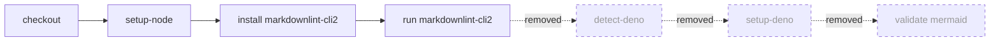

## Summary

Removed the dead cross-repo "optional Mermaid validation" block from
`.github/workflows/markdown-lint.yml`. The block's three steps —
`Detect Deno worker module` (`id: detect-deno`), the conditional
`denoland/setup-deno`, and `Validate Mermaid blocks` — all keyed off
`worker/deno/mod.ts`, a module that belongs to the Vibe Coder worker's layout
and does **not** exist anywhere in NEAT-AI. The detect step therefore always
emitted `present=false`, so the two guarded steps were permanently skipped. The
whole block was cross-repo template scaffolding: dead weight that ran on every
push/PR for no behaviour and was a latent foot-gun (an unreviewed `deno run`
step would silently activate if `worker/deno/mod.ts` were ever added). The
`markdownlint` job now ends cleanly after `Run markdownlint-cli2`.

Closes #3228.

## Changes

- `.github/workflows/markdown-lint.yml` — deleted the `detect-deno`,
  `setup-deno`, and `Validate Mermaid blocks` steps.
- `test/scripts/MarkdownLintWorkflow.ts` — the test that asserted the dead block
  **exists** was inverted into a regression test asserting it stays **gone**
  (no `detect-deno` step, no `check-mermaid` run, no `worker/deno/mod.ts`
  reference). This test change is required by the workflow change and is
  documented here per the "do not silently modify tests" rule.
- `test/ci/MarkdownLintStrictMode.ts` — **deleted.** This file existed solely to
  assert the `Detect Deno worker module` run block opened with
  `set -Eeuo pipefail` (Issue #3006). With that step removed the file has no
  subject, so it was removed rather than left asserting against a non-existent
  step.



## Evidence

Backend/CI-config change only — no web interface to screenshot. Verified via the
workflow's Deno test suite:

```
running 8 tests from ./test/scripts/MarkdownLintWorkflow.ts
...
markdown-lint workflow omits the dead cross-repo Mermaid block (Issue #3228) ... ok
ok | 8 passed | 0 failed
```

## Test Plan

- Updated `test/scripts/MarkdownLintWorkflow.ts::"markdown-lint workflow omits
  the dead cross-repo Mermaid block (Issue #3228)"` — fails against the
  un-edited workflow (dead block present), passes after removal. Acts as the
  regression guard.
- Removed the now-obsolete `test/ci/MarkdownLintStrictMode.ts`.
- Ran `deno fmt --check` (1135 files) and `deno lint` — clean.

## Out of scope

`./quality.sh` reports one **pre-existing, unrelated** failure:
`test/ErrorGuidedStructuralEvolution/NeuronDiscoveryIntegration.ts` ("Unhandled
variant: setBias" from the Rust scorer path). Confirmed by `git stash` — it
fails on a clean tree without any of this PR's changes, so it is not introduced
here and is outside the scope of #3228.
