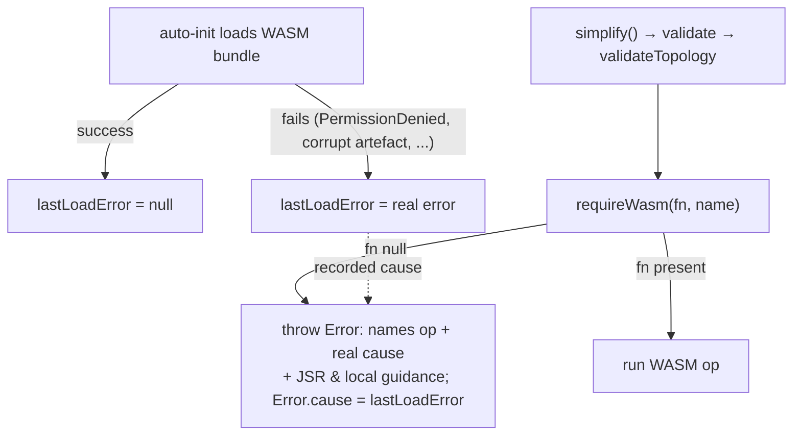

# Fail loud with the real WASM load cause in topology ops

## Summary

A NEAT-AI training run aborted inside `simplify()` because
`WasmTopologyOps.validateTopology` "could not load the NEAT-AI-core WASM
bundle". The guard `requireWasm` threw a generic message telling the caller to
`Run ./build.sh` — useless to a project consuming `@stsoftware/neat-ai` from JSR
(which cannot rebuild the vendored bundle) — and, critically, it **hid the real
reason** the bundle failed to load. Auto-init (`WasmAutoInit.ts` /
`initWasmActivation`) deliberately swallows the load failure and returns
`false`, so the underlying cause (e.g. a Deno `PermissionDenied` net/read error,
or a corrupt artefact) never reached the operator.

This fix makes the failure **loud with its true cause** (Issue #3234) instead of
masking it:

- `WasmModuleLoader` now records the last load failure in `lastLoadError` during
  both async (`initWasmActivation`) and sync (`initWasmActivationSync`) init,
  clears it on success, and exposes it via a new `getWasmLoadError()` getter
  (also re-exported from `src/wasm/mod.ts`).
- `WasmTopologyOps.requireWasm` now surfaces that underlying cause in its error
  message, attaches the original error via `Error.cause` for diagnostics, and
  gives actionable guidance for **both** JSR consumers (ensure the runtime can
  load the vendored bundle — Deno needs read/net access to fetch
  `wasm_activation_bg.wasm`) **and** local developers (`./build.sh`).

Consistent with the project's core-dependency policy, **no TypeScript fallback**
is introduced — topology validation stays WASM-only. Only the failure
diagnostics improve; a missing bundle is an environment/config fault that must
fail loud, not silently degrade.

The published 5.7.x artefact does ship a loadable bundle: `deno.json`'s
`publish.include` carries `wasm_activation/pkg/**` and those files are committed
(see `wasm_activation/pkg/.gitignore`), so the fix targets the diagnostics gap,
which is the actionable root cause per the issue's investigation areas.

Closes #3230.

## Evidence

This is a backend/library change with no web interface to screenshot. Evidence
is the new unit tests (below) plus the failure-path flow:

Before:
`… requires the NEAT-AI-core WASM bundle, but it could not be loaded. Run
./build.sh …`
(no cause).

After:
`… requires the NEAT-AI-core WASM bundle, but it could not be loaded.
Underlying load error: PermissionDenied: Requires net access to "jsr.io". If you
are consuming @stsoftware/neat-ai from JSR, ensure the runtime can load the
vendored bundle … If you are developing NEAT-AI locally, run ./build.sh …`
with the original error attached via `Error.cause`.

## Test Plan

- Added `test/wasm/WasmTopologyOpsRequireWasm.ts`:
  - `requireWasm` returns the function when the bundle is loaded.
  - `requireWasm` surfaces the injected underlying load error in the message and
    attaches it via `Error.cause`, and includes JSR-consumer guidance
    (reproduces the reported abort's missing-cause defect).
  - `requireWasm` explains a never-initialised bundle when no cause was recorded
    (and attaches no `cause`).
- Added `test/wasm/WasmLoadErrorIntrospection.ts`:
  - `getWasmLoadError()` is `null` after a successful load (no spurious cause).

All four new tests pass. `deno fmt --check`, `deno lint`, and `deno check` pass
on the touched files.

### Pre-existing unrelated failure

`./quality.sh` reports one **pre-existing** failure unrelated to this change —
`test/ErrorGuidedStructuralEvolution/NeuronDiscoveryIntegration.ts`
("collectRustAnalysisCandidates returns analysis bundle") fails with
`Unhandled variant: {"type":"setBias",…}` from the locally-built Rust Discovery
library. It fails identically on the clean tree (verified by stashing this
change) and touches none of the WASM-loader files modified here.
