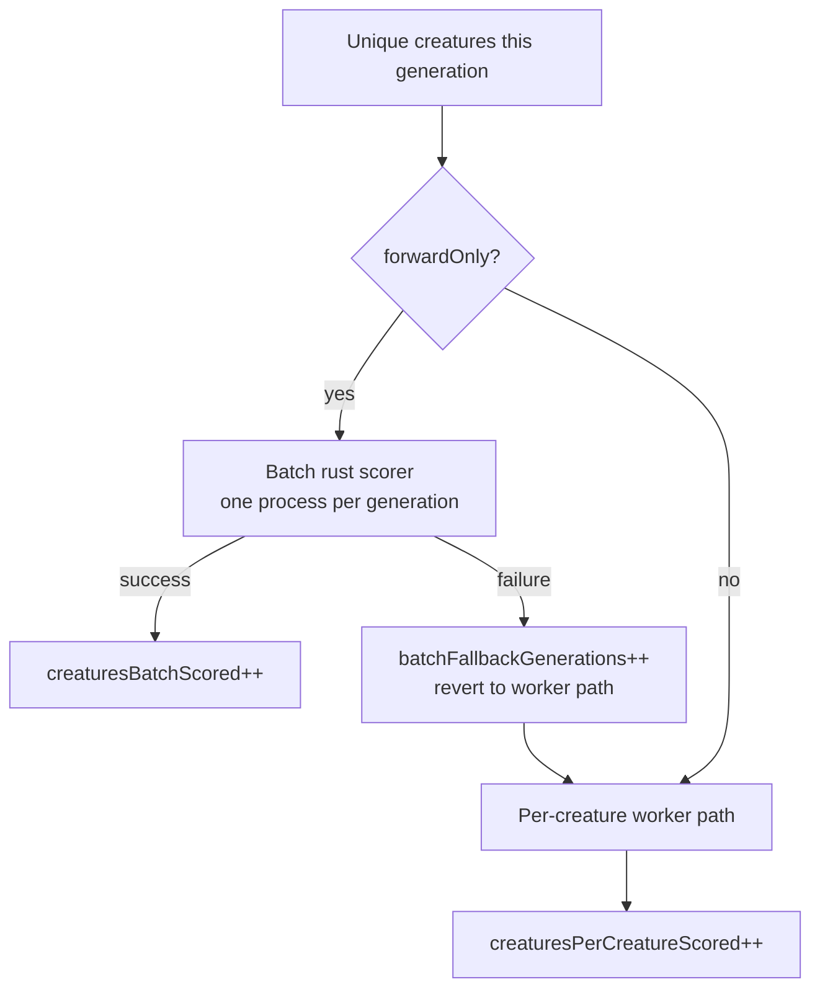

## Summary

Instrument `Fitness` with per-backend scorer-utilisation counts and expose them
on the `evolve*/train` result. Previously `Fitness.calculate()` tracked a single
`lastScoredCreatureCount` that spanned **both** the Rust native **batch
(one-pass)** path and the **per-creature worker** path, so a silent regression —
the batch path breaks and every creature quietly falls back to the slow worker
path — looked identical to a healthy run. This change splits that count by
backend and adds an explicit batch-fallback tally so the split is visible in the
run result (and therefore in the GRQ-cluster `result.json`). Telemetry only — no
change to scoring numbers or the batch/worker partition.

**Closes #3234.**

What changed:

- **`src/architecture/Fitness.ts`** — new per-generation counters
  `lastCreaturesBatchScored`, `lastCreaturesPerCreatureScored`, and
  `lastBatchFallbackOccurred`. The scored tally is split into `batchScoredCount`
  / `workerScoredCount`; `lastScoredCreatureCount` stays equal to their sum for
  existing throughput consumers. The batch `catch` block now sets the fallback
  flag so a partial/whole fallback is never masked. All new counters are reset
  in the early-return path alongside the existing resets.
- **`src/creature/ScorerUtilisationTotals.ts`** (new) —
  `ScorerUtilisationTotals` type + accumulator
  (`create`/`accumulate`/`finalise`), mirroring `PhaseTimingTotals`.
- **`src/creature/CreatureTraining.ts`** — accumulate the per-generation counts
  across the run and finalise a `scorerUtilisation` field on the result of
  `evolveDir`, `evolveEnv`, `evolveRL` (and `evolveDataSet`, which delegates to
  `evolveDir`). Return types updated.
- **`src/Creature.ts`** — `scorerUtilisation` added to the four wrapper return
  types.
- **`src/creature/EpisodicFitness.ts` / `RLEpisodeFitness.ts`** — reset the new
  counters and report every scored creature under `creaturesPerCreatureScored`
  (these paths never use the native batch scorer).
- **`src/NEAT/NeatEvolution.ts`** — per-generation split emitted on the verbose
  `[Throughput]` log line (`batchScored…/perCreatureScored…/batchFallback…`).
- **`docs/event-driven-evolution.md`** — new "Run-level scorer-utilisation
  totals" section with a Mermaid backend-split diagram.

## Evidence

Backend/CLI change — no web interface to screenshot. Verified via new and
existing unit/integration tests (`deno test`) and the repo type gate
(`./quality.sh --check-only`, `--lint-only`).

Selected results:

- `test/architecture/FitnessScorerUtilisation.ts` — 4 passed
- `test/creature/ScorerUtilisationTotals_test.ts` — 4 passed
- `test/creature/EvolveScorerUtilisation.ts` — 1 passed
- `deno test test/architecture/*.ts test/score/*.ts` — 629 passed, 0 failed
  (regression guard on scoring behaviour)
- `deno test test/creature/*.ts` — 62 passed, 0 failed (episodic/RL paths)
- `./quality.sh --check-only` and `--lint-only` — clean

## Test Plan

New tests added:

- **`test/creature/ScorerUtilisationTotals_test.ts`** — accumulator unit tests:
  empty finalises to zeros; an all-batch run yields
  `batchScorerInvocations ≈ generations` with zero fallback; a mixed population
  counts recurrent creatures under `creaturesPerCreatureScored`; a fallback
  generation increments `batchFallbackGenerations` and counts its creatures
  per-creature.
- **`test/architecture/FitnessScorerUtilisation.ts`** — `Fitness.calculate()`
  split tests against a stubbed rust scorer: (a) all-forwardOnly →
  `creaturesBatchScored === N`, zero fallback; (b) mixed → recurrent creatures
  counted per-creature; (c) forced batch failure (stubbed to return no keys) →
  `lastBatchFallbackOccurred === true`, `creaturesBatchScored === 0`, affected
  creatures counted per-creature; plus an empty-population reset check.
- **`test/creature/EvolveScorerUtilisation.ts`** — `evolveDataSet` returns a
  populated `scorerUtilisation` whose `generations` matches the
  `generation_complete` event count, with per-creature scoring accumulated
  across generations and zero batch invocations/fallbacks in the WASM-only
  environment.

A silent-fallback regression (batch path breaks but scoring still succeeds via
workers) is caught by tests (b)/(c) and by the runtime `[Throughput]` log line.
