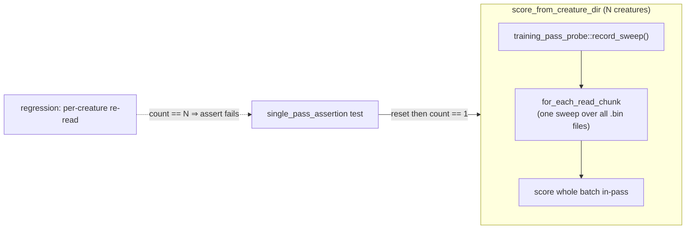

# NEAT-AI-scorer: assert multi-creature batch scoring makes exactly one pass over training data

## Summary

Adds a **permanent automated assertion** that multi-creature (directory/batch)
scoring in NEAT-AI-scorer reads the training data in **exactly one pass**,
scoring the whole batch in that single sweep — so the "one pass over the
training data" property is guaranteed by the test suite, not just by
inspection. This is the "permanent automated assertion" half of the practice
confirmation tracked under the milestone parent #3233. Closes #3236.

The actual code lands in the sibling **stSoftwareAU/NEAT-AI-scorer** repository
(the Rust scorer is a separate internal repo), delivered as
**stSoftwareAU/NEAT-AI-scorer#300**. This PR — against the milestone branch
`milestone/3233-flag-rust-scorer-utilisation-in-results-verif` — records the
cross-repo work and carries the closing keyword for issue #3236, since GitHub
closing keywords only auto-close within the same repository.

## Cross-repo change (stSoftwareAU/NEAT-AI-scorer#300)

- **Instrumentation** — `rust_scorer/src/multi_score.rs` gains a process-global
  `training_pass_probe` sweep counter (`reset` / `count` / `record_sweep`).
  `record_sweep()` is invoked immediately before each
  `neat_core::training_bin_stream::for_each_read_chunk` call in all three batch
  paths (CPU, GPU-synchronous, GPU-pipelined). Production overhead is a single
  atomic increment per whole scoring run.
- **Test** — `rust_scorer/tests/single_pass_assertion.rs`:
  - `multi_creature_batch_makes_exactly_one_pass` — scoring N ∈ {2, 5, 11}
    creatures traverses the training data **once**, independent of N.
  - `multi_creature_batch_one_pass_across_multiple_bin_files` — a single sweep
    covers a multi-`.bin`-file corpus.
  - `single_creature_makes_exactly_one_pass` — contrast case (Scope item 3)
    pinning that N == 1 shares the one-sweep contract.

If a future change reintroduces per-creature re-reads of the training data, the
counter reports **N** instead of `1` and the `assert_eq!` fails — breaking
`cargo test` in the NEAT-AI-scorer CI before the regression can merge.

## Evidence

Backend/CLI change with no web interface to screenshot. Verification is the
test suite in the scorer repo:

- `cargo test -p rust_scorer` — all suites pass, including the new
  `single_pass_assertion` (3/3); no existing test regressed.
- `cargo fmt --check` and `cargo clippy --all-targets` both clean.
- **Regression-detection proof** — temporarily wrapping the CPU-path sweep in
  `for _ in 0..loaded.len()` (simulating per-creature re-reads) made the
  assertion fail loudly (`observed 2` / `observed 4`, expected `1`); reverting
  restored green.

## Test Plan

Delivered in stSoftwareAU/NEAT-AI-scorer#300:

- Added `rust_scorer/tests/single_pass_assertion.rs` with three tests
  (`multi_creature_batch_makes_exactly_one_pass`,
  `multi_creature_batch_one_pass_across_multiple_bin_files`,
  `single_creature_makes_exactly_one_pass`).
- Verified the new tests fail when a per-creature re-read regression is injected
  and pass once reverted.
- `cargo test -p rust_scorer`, `cargo fmt --check`, `cargo clippy --all-targets`
  all pass.
