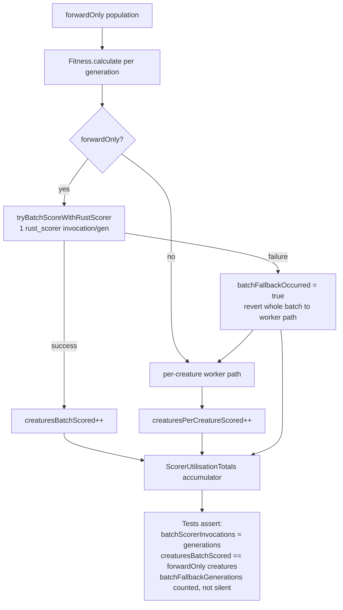

# Assert forwardOnly population uses the Rust batch path (and fallback is counted)

## Summary

Adds two **permanent automated assertions** that a `forwardOnly` population is
scored via the Rust **batch** path — one `rust_scorer` invocation per generation
— and that a batch failure is surfaced as a measurable **fallback**, never
silently swallowed. Both tests drive `Fitness.calculate()` across several
generations and accumulate each generation's per-backend counts into the
run-level `ScorerUtilisationTotals` (the same telemetry surfaced on the
`evolve*` result and in the GRQ-cluster `result.json`), then assert on the
aggregate. Closes #3237.

The per-backend instrumentation this issue depends on
(`Fitness.lastBatchScorerInvocations` / `lastCreaturesBatchScored` /
`lastCreaturesPerCreatureScored` / `lastBatchFallbackOccurred` and the
`ScorerUtilisationTotals` accumulator) already landed via the sibling
instrumentation sub-issue, so this change is **test-only** — it locks that
signal behind a regression gate that fails the PR before merge if the batch path
silently stops being used or a fallback stops being recorded.

## Evidence

Backend/CLI change — no web interface to screenshot. Verified by test execution
and by a negative-control check (temporarily routing `forwardOnly` creatures
onto the worker path made `FitnessBatchPathUsed.ts` fail as intended, confirming
it is a genuine regression detector, then the source was restored).

## Test Plan

- **`test/architecture/FitnessBatchPathUsed.ts`** — all-`forwardOnly` population
  over 4 generations with the batch scorer enabled (mock success runner).
  Asserts `batchScorerInvocations` == generations, `creaturesBatchScored` ==
  forwardOnly creatures × generations, `creaturesPerCreatureScored` == 0, the
  worker path was never called, and `batchFallbackGenerations` == 0 — i.e. the
  batch path was used, not the per-creature worker path.
- **`test/architecture/FitnessBatchFallbackCounted.ts`** — all-`forwardOnly`
  population over 3 generations with a runner that forces a `BatchScorerError`
  (missing keys). Asserts `batchFallbackGenerations` > 0 (== generations), the
  affected creatures are counted as per-creature-scored, nothing is
  batch-scored, and every creature still ends each generation with a valid,
  finite score — the fallback is graceful and counted, never masked as success.
- `deno fmt`, `deno lint`, and `deno check` pass on both new files.
- Full `./quality.sh --skip-discovery --skip-wasm` run: **7458 passed**
  (includes both new tests). One unrelated, pre-existing failure —
  `test/ErrorGuidedStructuralEvolution/NeuronDiscoveryIntegration.ts`
  (`Unhandled variant: setBias` from the Rust discovery FFI mapper) — reproduces
  on the clean milestone tree **without** these new files, so it is an
  environmental discovery-library/TS version mismatch (discovery build was
  skipped), not a regression from this change.
