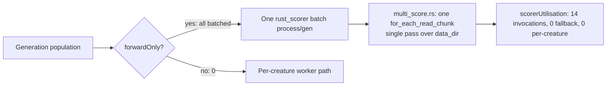

# PR Summary — One-off practice verification of the native batch `rust_scorer` (Issue #3238)

## Summary

Produced the **one-off practice verification** parent #3233 asked for: real
run/log evidence that the Rust native scorer's **batch path** was used and that
it scored many creatures in **one pass** over the training data. A reproducible
harness drives a representative `evolveDataSet` job with the native batch scorer
enabled, wraps the real `rust_scorer` binary in a shim that counts process
spawns, and captures the four evidence items. The evidence was posted as a
comment on #3233 and the machine-readable artifact + reproduction script are
committed here. Closes #3238.

Result of the real run (14 aggregated generations, population 24, forwardOnly):

- **14** `[NEAT-AI] Batch scorer partition` log lines — one per generation,
  whole population batched, 0 recurrent.
- **14** OS batch `rust_scorer` spawns (+1 one-off `--help` cost probe) — one
  process per generation over a single shared `<data_dir>`, not one per
  creature.
- `scorerUtilisation`: `batchScorerInvocations: 14`,
  `creaturesBatchScored: 322`, `creaturesPerCreatureScored: 0`,
  `batchFallbackGenerations: 0` — no silent fallback.
- **No discrepancies.** The single discrepancy called out is process-level, not
  runtime: the permanent one-pass assertion (issue #3236) is authored in
  NEAT-AI-scorer PR **#300** which is still open (not yet merged); this is
  already tracked by that open PR, so no new follow-up was filed.

This is not a performance task — no code path changed, so no before/after
benchmark applies. Permanent CI regression coverage is owned by the closed
sibling issues (#3234, #3235, #3236, #3237); this PR deliberately does not
duplicate that scope. The added unit tests cover the verification harness's own
regression-detection logic.

## Evidence

Backend/CLI change with no web interface to screenshot — verification is the
committed real-run artifact and the harness unit tests. Full capture:
`docs/evidence/verify-3238-result.json`; narrative:
`docs/evidence/verify-3238-batch-scorer.md`; comment posted on #3233.

## Test Plan

- Added `test/scripts/VerifyBatchScorerUtilisation.ts` (7 cases) exercising the
  pure helpers in `scripts/verifyBatchScorerUtilisationLib.ts`:
  - `classifySpawns` splits the one-off `--help` probe from batch invocations
    and handles an empty log.
  - `detectDiscrepancies` returns none for a healthy run and flags each failure
    mode: missing partition line, per-creature fallback, spawn/invocation
    mismatch, and `invocations != generations`.
- Ran the harness end-to-end against the real `rust_scorer` binary; all in-run
  checks passed and the committed artifact records the result.
