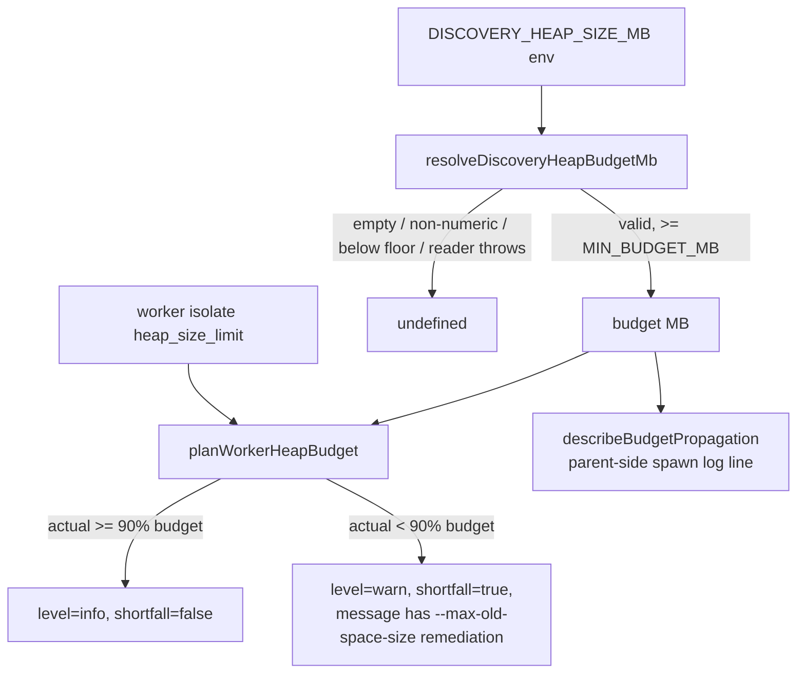

# Untested public functions in `src/workers/WorkerHeapBudget.ts`

## Summary

Four exported functions in `src/workers/WorkerHeapBudget.ts` had no test
asserting their observable behaviour. The similarly-named test file
`test/workers/WorkerHeapBudget.ts` actually imports and exercises the
**parallel** heap-budget implementation in `src/workers/WorkerHandlerBase.ts`,
so the `WorkerHeapBudget.ts` module was reached only transitively and never had
its own safety net. A refactor — or a bad merge with the parallel copy — could
have silently inverted the shortfall comparison, dropped the `MIN_BUDGET_MB`
floor, or corrupted the operator-facing remediation message, and the suite would
still have passed.

This PR adds `test/workers/WorkerHeapBudgetCore.ts`, a WHAT-test that asserts
the observable outputs of the pure functions (no mocking of internals), so it
keeps passing across any reimplementation that preserves the same decisions. No
production code was changed — this is a coverage-gap fix.

`Closes #3247`.

## Evidence

Backend/library change with no web interface to screenshot. Verified by running
the new test file:

```
running 13 tests from ./test/workers/WorkerHeapBudgetCore.ts
... ok | 13 passed | 0 failed
```

`deno fmt --check`, `deno lint`, and `deno check` all pass on the new file.

The functions under test and the behaviour each test guards:



## Test Plan

Added `test/workers/WorkerHeapBudgetCore.ts` (13 tests):

- `resolveDiscoveryHeapBudgetMb` — valid integer, whitespace trimming,
  unset/empty rejection, non-numeric/non-integer rejection, `MIN_BUDGET_MB`
  floor (63 rejected, 64 accepted), and a throwing env reader treated as
  unconfigured.
- `currentHeapLimitMb` — returns a positive integer heap limit.
- `describeBudgetPropagation` — describes a configured budget (worker name +
  `--max-old-space-size` flag) and returns `undefined` when unconfigured.
- `planWorkerHeapBudget` — within-budget (`shortfall=false`, `level=info`), the
  90% shortfall boundary (3686 within / 3685 shortfall for a 4096 MB budget),
  the GRQ-23 shape (`shortfall=true`, `level=warn`, message carries the
  `--max-old-space-size` remediation), and `undefined` when `budgetMb` is
  `undefined`.

The existing `test/workers/WorkerHeapBudget.ts` (covering
`WorkerHandlerBase.ts`) is left untouched.
