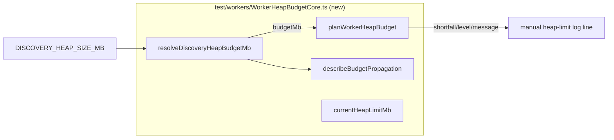

## Summary

The four exported functions in `src/workers/WorkerHeapBudget.ts`
(`resolveDiscoveryHeapBudgetMb`, `currentHeapLimitMb`,
`describeBudgetPropagation`, `planWorkerHeapBudget`) had no test exercising their
observable behaviour. The similarly named `test/workers/WorkerHeapBudget.ts`
actually tests a *different* module — the parallel heap-budget implementation on
`WorkerHandlerBase.ts` — so these pure functions had no safety net and a bad
refactor (or a merge with the parallel copy) could silently invert the shortfall
comparison, drop the `MIN_BUDGET_MB` floor, or corrupt the operator-facing
remediation message with the whole suite still green.

This adds a new WHAT-test file, `test/workers/WorkerHeapBudgetCore.ts`, that
asserts the *observable outputs* of these pure functions directly — no mocking
of internals — so the tests keep passing across any reimplementation that
preserves the same decisions. The existing colliding test file is left
untouched (it covers a real, separate module). No production code changed.

Closes #3247.

## Evidence

Backend/library change only — no web interface to screenshot. Verification is
the new test run.

The `WorkerHeapBudget.ts` functions are reached only through
`workerEntryPoint.verifyWorkerHeapBudget`, whose own test never drives the
heap-budget wrapper — hence the gap this test closes:



New test run (12 tests, all passing):

```
running 12 tests from ./test/workers/WorkerHeapBudgetCore.ts
... ok
ok | 12 passed | 0 failed
```

`deno fmt`, `deno lint`, and `deno check` pass cleanly on the new file. The full
`quality.sh` suite reports two pre-existing failures unrelated to this change
(`test/ErrorGuidedStructuralEvolution/NeuronDiscoveryIntegration.ts` and
`test/lifecycle/ForwardOnlyApplyChangeLifecycle.ts`) — both reproduce on the
clean tree with this file stashed, confirming they are not caused by this PR.

## Test Plan

Added `test/workers/WorkerHeapBudgetCore.ts` covering the observable outputs of
the four untested exports:

- `resolveDiscoveryHeapBudgetMb` — valid integer (with whitespace trimming);
  `undefined` for unset/empty, non-numeric/non-integer, and below-`MIN_BUDGET_MB`
  (with the 64 MB floor as an accepted boundary); `undefined` when the env reader
  throws (no `--allow-env`).
- `planWorkerHeapBudget` — within-budget (`shortfall === false`,
  `level === "info"`); materially smaller limit (`shortfall === true`,
  `level === "warn"`, message contains the `--max-old-space-size` remediation);
  the `SHORTFALL_FRACTION` (0.9) boundary; `undefined` when `budgetMb` is
  `undefined`.
- `describeBudgetPropagation` — the spawn log line for a configured budget;
  `undefined` when unconfigured.
- `currentHeapLimitMb` — returns a positive integer MB.
