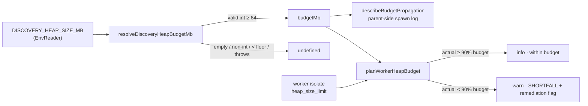

## Summary

Closed a test-coverage gap in `src/workers/WorkerHeapBudget.ts`. Four exported
functions had no test exercising their observable behaviour, and no tested
caller reached them — the similarly-named `test/workers/WorkerHeapBudget.ts`
actually covers a _different_ module (`WorkerHandlerBase.ts`). A refactor or a
bad merge with that parallel implementation could silently invert the shortfall
comparison, drop the `MIN_BUDGET_MB` floor, or corrupt the operator remediation
message, and the whole suite would still pass.

Added `test/workers/WorkerHeapBudgetCore.ts` with WHAT-tests asserting the
observable outputs of the pure functions — no mocking of internals. The tests
protect the _behaviour_ (the shortfall/threshold decision, the env-validation
floor, and the GRQ-23 remediation message) so they keep passing across any
reimplementation that preserves the same decisions.

No production code changed — this is a pure test-coverage addition.

Closes #3247.

## Change type

Backend/CLI test-only change — no web interface to screenshot. Evidence is the
new test suite passing (below).

## Coverage added

- `resolveDiscoveryHeapBudgetMb` — valid value, whitespace trim, unset/empty,
  non-numeric/non-integer, the `MIN_BUDGET_MB = 64` floor (63 rejected, 64
  accepted), and a throwing (no `--allow-env`) reader treated as unconfigured.
- `currentHeapLimitMb` — returns a plausible positive integer isolate limit.
- `describeBudgetPropagation` — builds the spawn log line for a configured
  budget; `undefined` when unconfigured.
- `planWorkerHeapBudget` — within-budget (`shortfall === false`,
  `level === "info"`), the 90% threshold boundary, materially-smaller isolate
  (`shortfall === true`, `level === "warn"`, message carries the
  `--max-old-space-size` remediation), and `undefined` when `budgetMb` is
  `undefined`.

## Test Plan

- Added `test/workers/WorkerHeapBudgetCore.ts` (13 tests) — all pass:
  `deno test test/workers/WorkerHeapBudgetCore.ts` → `13 passed | 0 failed`.
- All worker tests still pass: `64 passed | 0 failed`.
- `deno lint` and `deno fmt --check` clean on the new file.

## Notes

- The existing colliding file `test/workers/WorkerHeapBudget.ts` was left
  untouched (it validly covers `WorkerHandlerBase.ts`); the new file is named
  `WorkerHeapBudgetCore.ts` to avoid ambiguity, as suggested in the issue.
- Two unrelated tests
  (`ErrorGuidedStructuralEvolution/NeuronDiscoveryIntegration.ts` and
  `score/RustScorerBridgeHardening.ts`) fail on this working tree due to a stale
  vendored WASM/Rust bundle (an "Unhandled variant: setBias" mismatch); they are
  pre-existing, environmental, and unrelated to this test-only change.
