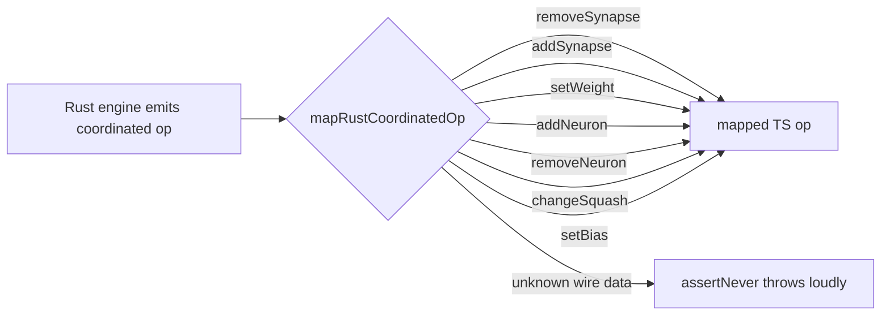

## Summary

`mapRustCoordinatedOp` in
`src/architecture/ErrorGuidedStructuralEvolution/DiscoverAnalysis.ts` only mapped
the two synapse coordinated-op variants (`removeSynapse`, `addSynapse`). The Rust
discovery engine, however, emits the **full** coordinated-op set — including
`setBias`, `setWeight`, `addNeuron`, `removeNeuron` and `changeSquash`. When the
Rust analysis path returned a `setBias` op it fell through to `assertNever` and
threw at runtime:

```
Error: Unhandled variant: {"type":"setBias","neuronUuid":"L1-a","bias":-0.80727166}
```

Root cause: the `RustCoordinatedStructuralOperation` union and its mapper were
out of lock-step with both the TypeScript `CoordinatedStructuralOperation` union
and the apply side (`ApplyCoordinatedStructuralCandidate.ts`), which already
handled all seven variants. This fix brings the FFI boundary type and mapper up
to the full variant set so every op the engine emits is mapped instead of hitting
the loud `assertNever` guard. Malformed/unknown wire data still fails loudly.

Closes #3250.

## Changes

- `RustDiscoveryTypes.ts` — extended `RustCoordinatedStructuralOperation` to
  cover `setWeight`, `addNeuron`, `removeNeuron`, `changeSquash` and `setBias`,
  mirroring the TS `CoordinatedStructuralOperation` union.
- `DiscoverAnalysis.ts` — added a mapping `case` for each of the five previously
  unhandled variants; the `default` branch still calls `assertNever`.
- `RustDiscovery.ts` — re-exported the five new Rust op interfaces from the
  barrel module.
- `MapRustCoordinatedOpExhaustiveness.ts` — added positive-mapping tests for
  every new variant. The pre-existing "throws on an unmapped variant" test used
  `setWeight` as its rogue example; since `setWeight` is now a real mapped
  variant (business-logic change required by this fix), it was switched to a
  genuinely-unknown discriminant (`teleportNeuron`) so it still exercises the
  `assertNever` guard.



## Evidence

Backend/FFI-only change — no web interface to screenshot. Verified via tests.

- The regression case (`setBias`) is reproduced by the new unit test
  `test/ErrorGuidedStructuralEvolution/MapRustCoordinatedOpExhaustiveness.ts::mapRustCoordinatedOp maps a setBias operation (Issue #3250)`.
- The originally-failing integration test now passes:
  `test/ErrorGuidedStructuralEvolution/NeuronDiscoveryIntegration.ts` →
  `4 passed | 0 failed`.
- Full `./quality.sh` passes: `7489 passed | 0 failed | 4 ignored`.

## Test Plan

- Added positive-mapping tests for `setWeight`, `setBias`, `changeSquash`,
  `removeNeuron` and `addNeuron` (with and without a placement hint) in
  `test/ErrorGuidedStructuralEvolution/MapRustCoordinatedOpExhaustiveness.ts`.
- Updated the "throws on an unmapped variant" test to use a genuinely-unknown
  discriminant so the `assertNever` guard is still exercised.
- Ran `test/ErrorGuidedStructuralEvolution/NeuronDiscoveryIntegration.ts`
  (previously failing) — now green.
- Ran the full `./quality.sh` gate — green.
