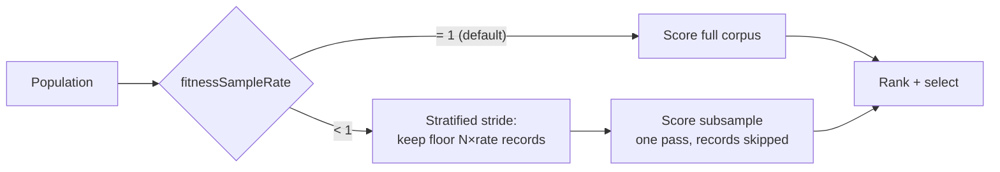

## Summary

Adds an optional **multi-fidelity fitness** knob, `fitnessSampleRate`, that
scores each creature on a **deterministic, stratified subsample** of the binary
fitness corpus during the per-generation ranking pass. Production evolution
spends ≈95 % of `evolveDir` wall-clock in fitness evaluation, so scoring fewer
records per generation is the single largest algorithmic lever available. The
subsample is applied inside the streaming `evaluateDir` reader — records are
skipped in **one pass, with no second corpus written to disk** — and the
**default stays `1.0`** (score the full corpus), so production quality is
unchanged unless a run opts in. **Closes #3257.**

Scope note (honest deferral): the issue targets the forward-only **Rust batch**
scorer path for the full production off-load. The native `rust_scorer` binary
cannot yet skip records inside its streaming reader, so a sub-`1` rate currently
stays on the TS/WASM path (which this PR fully implements and benchmarks). The
record-level skip in the scorer — plus the elite full-corpus **confirmation
pass** and the production 21 GiB corpus + Spearman ≥ 0.95 gate — is tracked as a
follow-up (see below), because it needs a scorer release and the production
corpus that this bench host does not have.

### What changed

- `src/creature/FitnessSubsample.ts` — pure, RNG-free stride selector: keep
  record `i` iff `floor((i+1)·rate) > floor(i·rate)` (keeps exactly
  `floor(N·rate)` records, evenly spread, fully deterministic across generations
  and machines). Plus `resolveFitnessSampleRate` clamp and
  `expectedSampledCount`.
- `evaluateDir` (`CreatureActivation.ts`) — applies the subsample on **both**
  the fused-WASM path (compacts each batch to the sampled records before the
  single fused call) and the per-record path. Full rate (`1`) takes the original
  code path with zero added work. A sub-`1` rate skips the native off-load so
  the requested subsample is honoured.
- Config — `fitnessSampleRate` added to `NeatArguments`, `NeatOptions`
  (numeric-coercible), and `createNeatConfig` (validated `0.0001..1`, default
  `1`), mirroring `trainingSampleRate`. Threaded through the worker init payload
  (`WorkerHandler` → `WorkerProcessor` → `evaluateDir`) so `evolveDir` honours
  it on the worker path.
- `bench/FitnessSampleRate.ts` — wall-clock + Spearman correlation harness.
- `docs/PERFORMANCE_TUNING.md` — new **Fitness Corpus Subsampling** section.

## Evidence

Backend/CLI change — no web interface to screenshot. Verified by benchmark and
unit tests.

**Benchmark** (`bench/FitnessSampleRate.ts`, 27.5 MiB synthetic corpus,
population 24, forward-only fused WASM path):

| rate | wall-clock | speedup | Spearman vs full |
| ---: | ---------: | ------: | ---------------: |
| 1.00 |     3738ms |   1.02× |           1.0000 |
| 0.50 |     2104ms |   1.80× |           1.0000 |
| 0.25 |     1067ms |   3.56× |           0.9991 |
| 0.10 |      468ms |   8.11× |           1.0000 |

Wall-clock falls ~proportionally to the rate (well past the ≥ 5 % gate); rank
order (Spearman) stays ≥ 0.999, above the suggested 0.95 preset bar, on this
uniform synthetic workload. Real production corpora may correlate less, which is
exactly why the **default is `1.0`** and enabling a sub-`1` preset should be
confirmed against the production corpus first (the follow-up covers that on the
GRQ corpus).

## Test Plan

- `test/creature/FitnessSubsample.ts` — stride maths: rate clamp, exact
  `floor(N·rate)` count, even stratification, determinism, phase rotation.
- `test/creature/FitnessSubsampleEvaluateDir.ts` — integration "what" tests:
  scoring the full corpus at `0.5` yields the **same** error as scoring a corpus
  containing only the sampled records (proving the reader kept exactly the
  stride and did less work), on both the fused and per-record paths; default `1`
  reproduces the full-corpus error exactly.
- `test/config/NeatConfigParseOptions.ts` — `fitnessSampleRate` default,
  number/string coercion, and out-of-range / non-numeric validation errors.

## Follow-up

The production Rust-batch off-load (record-level skip in the `rust_scorer`
streaming reader) and the elite full-corpus confirmation pass are tracked in
**stSoftwareAU/NEAT-AI-scorer#310**, cross-linked from this issue — they require
a scorer release and the production 21 GiB corpus for the merge-gate correlation
study, which this bench host cannot run.
