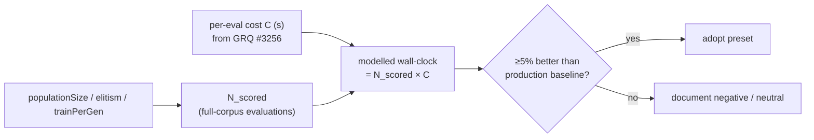

# [perf] Production pace-lever bake-off harness (Issue #3259)

## Summary

Parent milestone: **#3256** (production evolution wall-clock on the GRQ corpus).

The prior pace work (#2928–#2934, `bench/EvolutionPaceLeverComparison.ts`, Fast
Convergence preset) ranks generation-efficiency levers by **raw wall-clock on
tiny fixtures**, where a fitness evaluation is nearly free. Production is the
opposite regime: fitness is ≈95 % of wall-clock and each full-corpus evaluation
costs _minutes_ on a 21 GiB corpus, so that ranking does **not** transfer.

This PR ships the **transfer-correct measurement method** the issue asks for —
"implement code only where a knob is missing". The missing knob is a bake-off
whose primary metric survives the production cost regime:

> When fitness dominates and every full-corpus evaluation costs the same `C`
> seconds, wall-clock ≈ `N_scored × C`. Ranking levers by wall-clock is
> therefore equivalent to ranking them by **`N_scored`** (the count of
> full-corpus fitness evaluations) — a quantity **independent of `C`, hence of
> corpus size**. So the levers can be ranked faithfully on a laptop by counting
> scored evaluations, then multiplied by the GRQ per-eval cost (from #3256
> `phaseTimingTotals`) to model production wall-clock.

`bench/ProductionPaceLeverBakeOff.ts` sweeps `populationSize`,
`elitismFraction`, and `trainPerGen`, mirroring production's score-carry
contract exactly (`Fitness.calculate` scores only `score === undefined`
creatures — Issue #1016): elites carry their score and cost **zero** re-scores,
memetically-trained creatures are always re-scored.
`docs/PERFORMANCE_RESEARCH.md` records the methodology, the synthetic
sanity-check numbers, and the adoption gate.

**No default is flipped and no production preset is adopted.** The ≥5 % adoption
gate must be met on the **production creature + 21 GiB corpus** on GRQ hardware,
which is not reachable from CI or an autonomous worker. The follow-up production
run is tracked on the parent milestone **#3256**.

Closes #3259.

## Evidence

Backend/CLI change — no web interface to screenshot. Evidence is the harness's
own deterministic output and the passing tests.

Standalone synthetic sanity check (`C = 90 s` placeholder), directional dynamics
as expected — **methodology validation, NOT production evidence**:

| Sweep                                  | scored evals → target                                                                     |
| -------------------------------------- | ----------------------------------------------------------------------------------------- |
| `populationSize` 12 / 24 / 48          | **267 / 388 / 748** — smaller pop reaches the same score for far fewer full-corpus scores |
| `elitismFraction` 0 / 0.1 / 0.25 / 0.5 | **459 / 388 / 384 / 312** — carrying more elites removes redundant re-scores              |
| `trainPerGen` 0 / 2 / 6                | **706 / 432 / 388** — memetic backprop pays for its re-scores via faster convergence      |

## Test Plan

Added `test/bench/ProductionPaceLeverBakeOff.ts` (11 WHAT-tests, all passing):

- `runBakeOffConfig` is deterministic across repeated runs.
- Metrics are finite/non-negative and
  `modelledWallClockSeconds =
  scoredEvaluations × costPerEvalSeconds`.
- `eliteCount` grows with elitism and keeps ≥1; negatives clamp to the floor.
- **Elitism never increases scored evaluations** (score-carry contract).
- **`trainPerGen` adds full-corpus re-scores** (train=4 > train=0 strictly).
- Cost model is linear in `costPerEvalSeconds`.
- `runLeverSweep`, `recommendByWallClock`, and `formatBakeOffTable` behave.

`test/ci/BenchTaskConfig.ts` and `test/utils/NoUnusedStdDependency.ts` still
pass; `deno fmt`/`lint`/`check` and `markdownlint-cli2` are clean on the new
files.
