# PR Summary — Squash budget / GPU-hostable activation prior (Issue #3263)

## Summary

Adds an **opt-in evolutionary prior** ("squash budget") that restricts which
squash (activation) functions mutation and neuron creation may introduce. The
goal is to keep evolved populations cheap to score on CPU (fewer of the 34-type
zoo's expensive `libm` squashes) and easier to keep GPU-hostable. The feature is
**default off** — an empty allow-list means the existing free 34-type mix, so no
run changes behaviour unless an operator opts in. **Closes #3263.**

This is the _evolutionary prior_, not a kernel change; it complements the scorer
GPU-coverage and core SIMD work on the parent milestone #3256.

### What changed

- **`Activations` allow-list** — a global squash budget (same global-instance
  pattern as the seeded RNG). When set, `pickRandomSquash` — used by **every**
  squash-selection path (mutation, neuron creation, topology repair) — only ever
  returns an allowed squash. Aliases canonicalise (`RELU` → `ReLU`); unknown
  names **fail loud** with `ActivationError` at config time (Issue #3234). A
  restricted pool preserves relative mutation weights and never empties (falls
  back to the allowed names for zero-weight activations like `SOFTMAX`, and when
  an exclude would empty the pool).
- **Config** — `NeatOptions.squashBudget.allowedSquashes`, parsed and validated
  by `parseSquashBudget` and applied in `createNeatConfig` next to the RNG
  global. Stored on `NeatConfig` so the config is self-describing.
- **Telemetry** — a per-generation squash histogram (canonical name → population
  count) on every `generation_complete` training event and on `EvolveResult`, so
  an operator can watch the mix converge during an A/B run.

### Data flow

```mermaid
flowchart LR
    O[NeatOptions.squashBudget] --> P[parseSquashBudget<br/>shape validation]
    P --> C[createNeatConfig]
    C -->|setAllowedSquashes| A[Activations global budget<br/>unknown name = fail loud]
    A --> PR[pickRandomSquash]
    PR --> M[mutation / neuron creation<br/>only allowed squashes]
    M --> Pop[population]
    Pop --> H[computeSquashHistogram]
    H --> E[generation_complete event<br/>squashHistogram]
```

## Evidence

Backend/CLI change — no web interface to screenshot.

### Performance (selection cost is not the bottleneck — expected)

`bench/SquashBudgetSelection.ts`, Apple M2 Ultra, Deno 2.9.1, 1000 draws/iter:

| Squash pool                   | time/iter (avg) |
| ----------------------------- | --------------- |
| Free 34-type mix (baseline)   | ~85.5 µs        |
| GPU-hostable budget (4 types) | ~87.1 µs        |

The restricted draw is the same array-index operation, so **selection cost is
flat** — a negative result for the _selection_ path, exactly as the issue
predicted ("breeding is <5% of GRQ time"). The budget can only pay off
**downstream**: cheaper networks lower `fitnessMs`, and a GPU-hostable
population unlocks a measured GPU win — both live in the scoring path.

The full GRQ evolve wall-clock / `fitnessMs` A/B requires the production
creature seed, the production training corpus (≈21 GiB, not distributable), and
the GPU scorer — none reachable from CI or an autonomous worker. That
measurement, and the **≥5%** adoption gate that would flip the default, are
deferred to a human on GRQ per milestone #3256 and documented in
`docs/PERFORMANCE_RESEARCH.md`. The default stays **free mix**, so this PR adds
**zero regression risk** by default.

## Test Plan

New tests (all call real functions and assert on outcomes):

- `test/methods/activations/SquashBudget.ts` — allow-list restricts
  `pickRandomSquash`; alias canonicalisation; unknown name fails loud;
  null/empty clears; single-squash + exclude guard; zero-weight (`SOFTMAX`)
  fallback.
- `test/mutate/ModSquashBudget.ts` — the `ModActivation` operator **never**
  assigns a disallowed squash when a budget is set.
- `test/config/SquashBudgetConfig.ts` — `parseSquashBudget` validation
  (defaults, de-dup, rejects non-array / non-string / empty), and
  `createNeatConfig` applies the global budget / fails loud on unknown names.
- `test/NEAT/SquashHistogram.ts` — `computeSquashHistogram` counts hidden/output
  neurons by canonical name, excludes inputs/constants, aggregates a population,
  handles the empty case.

Regression safety: `test/_preload.ts` resets the global budget per worker
(mirrors the RNG reset). Verified `deno fmt`, `deno lint`, full `deno check`,
and the affected test suites (activations, config, mutate/ModSquash, NEAT evolve
phase-timing) — all green (91 + 22 relevant tests passing).

### Deno regression avoided

- Telemetry and config plumbing use Deno-native `deno test` / `deno bench` and
  the existing `NeatOptions` parser chain — no Node tooling introduced.
