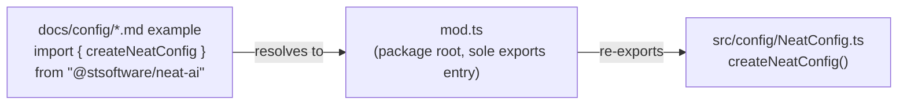

# PR Summary — Fix `docs/config/` imports (Issue #3271)

## Summary

Every code example under `docs/config/` imported from the non-existent package
scope `@anthropic/neat-ai`, so copy-pasting any config example failed to
resolve. The published package is `@stsoftware/neat-ai` (`deno.json:2`). A
second, related defect: the examples import `createNeatConfig`, which was
**not** re-exported from `mod.ts` (the package's sole `exports` entry) — it
lived only in `src/config/NeatConfig.ts`. So even with the scope fixed, the
examples still failed to import.

This PR fixes both defects so every `docs/config/` example works as written:

- **Scope corrected** — replaced `@anthropic/neat-ai` with `@stsoftware/neat-ai`
  in all nine affected `docs/config/*.md` files (CORE_EVOLUTION, DISCOVERY,
  LOGGING, MUTATION_ADAPTATION, POPULATION, PRESETS, RECIPES, TRAINING,
  WORKERS).
- **Export gap closed** — re-exported `createNeatConfig` and the `NeatConfig`
  type from `mod.ts`, so
  `import { createNeatConfig } from "@stsoftware/neat-ai"` now resolves. This
  also makes the `mod.ts` JSDoc preset example (lines 617-621) valid. The
  presets themselves (`QUICK_START_PRESET`, …) were already exported.
- **Style guard added** — `docs/DOC_STYLE.md` now records that example imports
  must use the published `@stsoftware/neat-ai` scope and may import only symbols
  actually re-exported from `mod.ts`.

The historical record in `docs/archive/pr-summaries/pr-summary-2966.md`
(documenting the earlier `@anthropic` → `@stsoftware` rename) is intentionally
left unchanged.

Closes #3271.

## Evidence

Backend/docs change — no web interface to screenshot. Verified via a new
public-export test that imports `createNeatConfig` from the package root and
exercises it exactly as the docs show, plus the existing quality gates.

Before this PR the example resolved to `@anthropic/neat-ai` (no such package),
and `createNeatConfig` was reachable only via a deep `src/…` path.

## Test Plan

- Added `test/docs/ConfigDocsExports.ts`:
  - `mod.ts re-exports createNeatConfig (docs/config CORE_EVOLUTION example)` —
    imports `createNeatConfig`/`NeatConfig` from `../../mod.ts` and asserts the
    returned config; this failed to type-check before the re-export was added
    (regression test for the export gap).
  - `createNeatConfig accepts a spread preset with an override (docs/config
    PRESETS example)`
    — reproduces the `{ ...QUICK_START_PRESET, populationSize:
    25 }` pattern
    from the docs.
- `deno test test/docs/ test/PublicExports_RL_test.ts` — passes.
- `./quality.sh --check-only` — passes (whole-project type-check).
- `./quality.sh --lint-only` — passes (fmt + lint + bash check).
