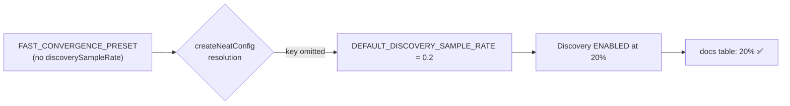

## Summary

`docs/config/PRESETS.md` listed `FAST_CONVERGENCE_PRESET` with **Discovery =
"Disabled"**, but the source contradicts that: the preset deliberately leaves
`discoverySampleRate` unset, so config resolution falls through to
`DEFAULT_DISCOVERY_SAMPLE_RATE` (`0.2` / 20%) and the Rust FFI discovery phase
runs. The source is authoritative — unlike `QUICK_START_PRESET` and
`MEMORY_CONSTRAINED_PRESET`, which explicitly set `discoverySampleRate: -1` to
disable discovery, `FAST_CONVERGENCE_PRESET` does not. Keeping discovery enabled
is consistent with the preset's stated purpose (reaching the target error in
_fewer generations_): structural discovery can help find better topologies
sooner, and the preset already trades extra per-generation compute for fewer
generations overall.

Chosen fix: option (a) from the issue — correct the docs to show 20% and make
the deliberate design choice explicit in both the docs and the source docstring,
so doc and source agree.

Changes:

- `docs/config/PRESETS.md` — table row now shows `20%`; the Fast Convergence
  description and trade-offs note that `discoverySampleRate` is left at the
  default and that discovery is **enabled** (not disabled for raw speed).
- `src/presets/Presets.ts` — added a rationale bullet documenting the deliberate
  unset of `discoverySampleRate` so future audits see the choice.
- `test/config/Presets.ts` — new test asserting the resolved
  `discoverySampleRate` equals `DEFAULT_DISCOVERY_SAMPLE_RATE`, locking
  docs/source agreement.

Closes #3272

## Evidence

Backend/docs change — no web UI to screenshot. Verified by the config-resolution
test suite exercising the real `createNeatConfig()` path:

```
deno test test/config/Presets.ts
...
Fast Convergence preset - discovery stays at the default sample rate ... ok
...
ok | 26 passed | 0 failed
```

`./quality.sh --lint-only` and `./quality.sh --check-only` both pass over the
full tree.



## Test Plan

- Added
  `test/config/Presets.ts::"Fast Convergence preset - discovery stays at
  the default sample rate"`
  — resolves the preset through `createNeatConfig()` and asserts
  `discoverySampleRate === DEFAULT_DISCOVERY_SAMPLE_RATE` (0.2), not `-1`, and
  `> 0`.
- Ran the full `test/config/Presets.ts` suite: 26 passed, 0 failed.
- `deno fmt`, `deno lint`, and `deno check` clean on the changed files;
  `./quality.sh --lint-only` and `--check-only` pass.
