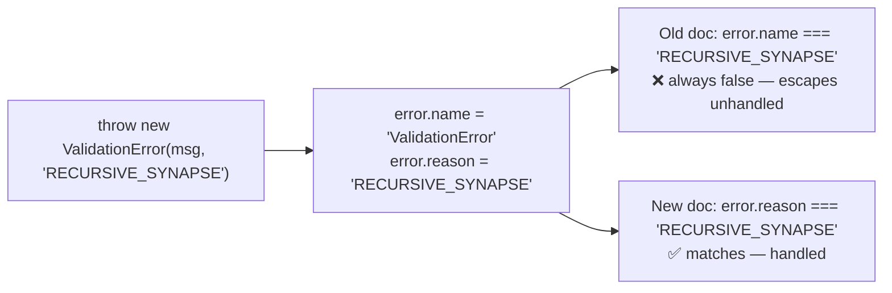

## Summary

`docs/api/ERRORS.md` documented a `ValidationError` handling pattern that could
**never** match, so callers who followed it silently failed to catch validation
errors — the worst kind of documentation bug under the project's "never fail
silently" principle.

The doc declared
`class ValidationError extends Error { name: ValidationErrorName; constructor(message, name); }`
and its handling example branched on `error.name === "RECURSIVE_SYNAPSE"`. But
in `src/errors/ValidationError.ts` the source is authoritative:

- `override readonly name = "ValidationError"` — `.name` is **always** the
  literal `"ValidationError"`, never the failure code.
- The failure code lives in a separate `readonly reason: ValidationErrorName`
  field, and the constructor's second parameter is `reason`, not `name`.

So `error.name === "RECURSIVE_SYNAPSE"` is always false; the documented `catch`
block never fired and the error escaped unhandled. The documented
`ValidationErrorName` union also listed only 7 members while the source defines
9 (missing `"NEURON_ORDER"` and `"DUPLICATE_SYNAPSE"`).

This PR rewrites `docs/api/ERRORS.md` to match the source and adds a doc-audit
test that ties the doc to real `ValidationError` runtime behaviour so the drift
cannot silently return.

Closes #3273.

### What changed

- Documented `name` as the fixed literal `"ValidationError"` and `reason` as the
  discriminant field carrying the failure code.
- Fixed the constructor signature to
  `(message: string, reason: ValidationErrorName)`.
- Fixed the handling example to branch on
  `error.name === "ValidationError" && error.reason === "RECURSIVE_SYNAPSE"`.
- Added the missing `"NEURON_ORDER"` and `"DUPLICATE_SYNAPSE"` union members
  (documented union now matches the 9-member source union).
- Added an `[!IMPORTANT]` admonition warning that matching a failure code
  against `error.name` can never be true.

## Evidence

Documentation + test change only — no web interface to screenshot. Verified via
the new and existing tests:

- New `test/docs/ErrorsDocMatchesValidationError.ts` — constructs real
  `ValidationError` instances (asserting `.name` is the literal and the code
  lives in `.reason`), then asserts the published doc documents `reason`, lists
  every one of the 9 reasons, and never teaches the impossible
  `name === "<REASON>"` pattern. The last assertion fails against the old doc
  and passes after the fix.
- Existing `test/docs/ApiReferenceSplit.ts` still passes — `ERRORS.md` relative
  links resolve and the doc remains substantive.
- Existing `test/errors/ValidationError.ts` still passes — confirms the source
  shape the doc now mirrors.
- Full `./quality.sh --skip-discovery --skip-wasm` run: **7576 passed, 0
  failed** (skipped only the unrelated Rust/WASM build steps).

## Test Plan

- Added `test/docs/ErrorsDocMatchesValidationError.ts`:
  - `ValidationError.name is the fixed literal, code lives in reason`
  - `ERRORS.md documents the discriminant field reason`
  - `ERRORS.md lists every ValidationErrorName reason`
  - `ERRORS.md never teaches the impossible name === <REASON> pattern`
- Re-ran existing `test/docs/ApiReferenceSplit.ts` and
  `test/errors/ValidationError.ts` — both green.
