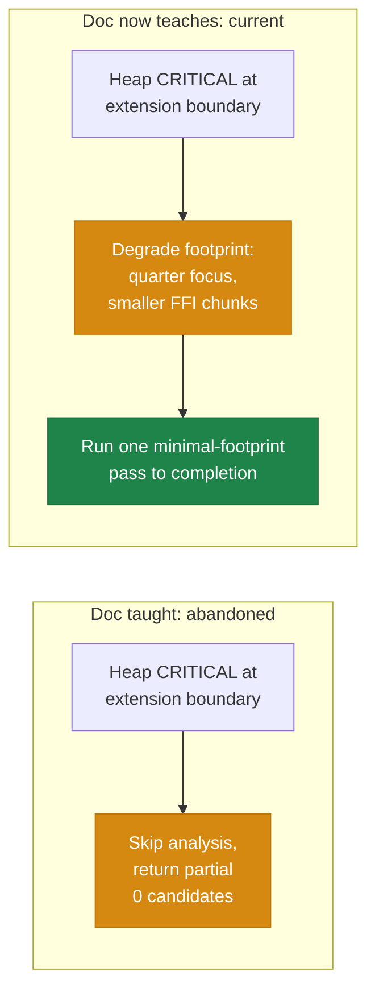

## Summary

`docs/troubleshooting/MEMORY.md` still taught the **abandoned** discovery
heap-pressure behaviour ("skip analysis, return partial") as if it were current,
while the durable learning that replaced it lived only in an at-risk PR summary.
This PR folds the **#3296 degrade-and-continue** learning — including its
**negative result** — into the "Heap guards around discovery analysis" section,
then deletes the now-absorbed PR summary. Closes #3274.

### What changed

- **`docs/troubleshooting/MEMORY.md` — extension-boundary guard prose** (item
  1): rewritten from "skips analysis and returns a partial result" to
  **degrade-and-continue** — `resolveDegradedAnalysisBoundary` reduces the focus
  breadth to a quarter of the neurons (floored at one), bounds the Rust FFI
  chunks to a small chunk, and runs one minimal-footprint pass to completion,
  logging each reduced knob's `from->to` value. The outcome is a genuine
  completion (candidates or an honest no-improvement result) instead of a
  zero-candidate skip.
- **Mermaid flow** (Off-heap awareness diagram): the CRITICAL branch that ended
  in `Skip analysis, return partial` now shows **Degrade footprint → Run one
  minimal-footprint pass to completion**.
- **New subsection "Degrade and continue at the extension boundary (Issue
  #3296)"**: records the **negative result** in a callout — _skip-to-partial was
  reclassified as a failure ("a loud degraded skip that returns zero candidates
  is still a failure"); do not re-attempt it_ — and notes the legacy
  `resolveHeapAbortBoundary` path is retained only for its unit tests, no longer
  the production path.
- **Deleted
  `docs/archive/pr-summaries/pr-summary-degrade-and-continue-3296.md`** — only
  **after** its learning was captured above, so no learning is dropped.

### Behaviour captured (before → after)

## Evidence

Documentation-only change — no code paths, no UI, no runtime behaviour altered.

- `deno fmt --check` clean on the changed markdown.
- `./quality.sh --lint-only` passes (format check on 2069 files, lint on 1781
  files, bash-syntax checks) — no TypeScript was touched, so the type-check and
  test gates are unaffected by this change.
- Verified no dangling references remain to the deleted PR summary
  (`grep -rn "degrade-and-continue-3296" docs/` → none).
- The prose matches the current source: `computeDegradedAnalysisKnobs` (quarter
  focus, floored at one; bounded chunk) in
  `src/architecture/ErrorGuidedStructuralEvolution/AnalysisDegradeDecision.ts`
  and `resolveDegradedAnalysisBoundary` /`degradedFirstPass` in
  `AnalysisExtensionBoundary.ts` / `DataRecorderAnalysis.ts`.

## Test Plan

No unit tests are added: this PR only edits prose and a Mermaid diagram in a
troubleshooting doc and deletes an absorbed PR summary. Per the repository
testing policy, tests assert on behaviour rather than doc content, and grepping
documentation is explicitly a "how" test to avoid. Validation was therefore the
format/lint gate above plus a manual read-through confirming the doc now
describes the degrade-and-continue behaviour and records the negative result.
