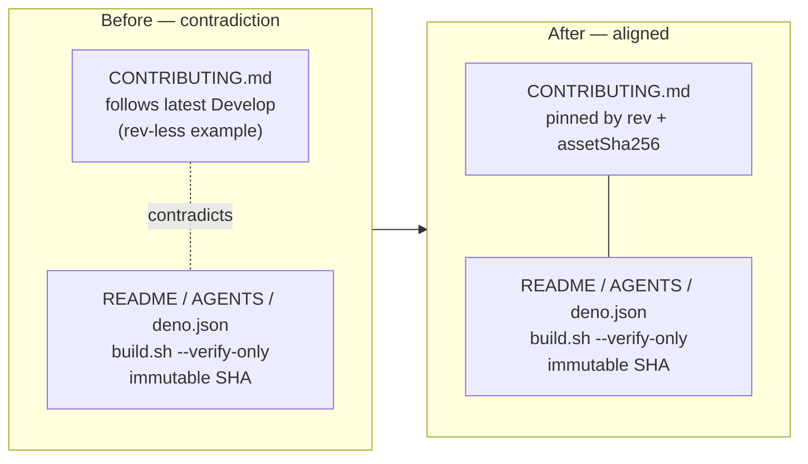

# Fix CONTRIBUTING.md core-pinning contradiction (immutable SHA, not branch)

## Summary

`CONTRIBUTING.md` described the NEAT-AI-core dependency as **branch-tracking**
("consumed by tracking `neatCore.ref` (default `Develop`)" and "By default,
NEAT-AI follows latest `Develop`", with a `rev`-less example config). That
contradicted the rest of the repo, which pins core by an **immutable 40-char
SHA**: `README.md`, `AGENTS.md`, `deno.json` (`neatCore.rev` + `assetSha256`),
and `build.sh --verify-only` (called by `quality.sh`). A first-time contributor
following the old wording would write a branch-tracking `neatCore` block and hit
a `quality.sh` failure they could not explain.

This rewrites the core-pinning section of `CONTRIBUTING.md` to match the
immutable-SHA policy:

- Describe pinning via `neatCore.rev` (40-char SHA) + `assetSha256` in
  `deno.json`, and clarify that `neatCore.ref` is only a human-readable branch
  label — not branch-tracking.
- Drop the "follows latest `Develop`" wording.
- Replace the `rev`-less example with a full `neatCore` block including `rev`
  and `assetSha256`, and note that a `rev`-less example would fail `quality.sh`
  (which runs `build.sh --verify-only`).
- Link `docs/EXTERNAL_NEAT_AI_CORE.md` as the authoritative bump workflow
  (alongside the existing `docs/CORE_DEPENDENCY_POLICY.md` link) rather than
  restating it.

Closes #3275.

## Evidence

Documentation + test change only; no web interface to screenshot. Verified via
`deno test`, `deno fmt --check`, `deno lint`, `markdownlint-cli2`, and
`./build.sh --verify-only` (exit 0).

The contradiction the fix removes:

## Test Plan

Added `test/scripts/ContributingCorePin.ts` (parses the `json` `neatCore` fenced
block in `CONTRIBUTING.md` and asserts against real values — no source
grepping):

- `CONTRIBUTING.md documents a json neatCore example` — the block exists.
- `CONTRIBUTING.md neatCore example is SHA-pinned, not branch-tracking` —
  example carries a 40-char hex `rev` and a 64-char hex `assetSha256`.
  Reproduces #3275: fails against the old `rev`-less example, passes after the
  fix.
- `CONTRIBUTING.md neatCore example agrees with deno.json on repo` — documented
  `repo` matches `deno.json`.
- `CONTRIBUTING.md does not claim core follows latest Develop` — the
  branch-tracking claim is gone.

All four pass; existing `test/scripts/CoreDependencyPolicy.ts` continues to
pass.
