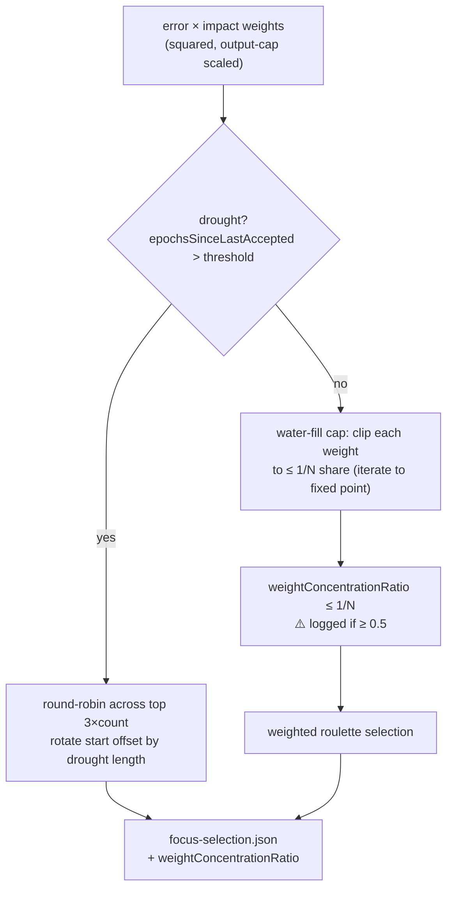

# Fold #3074 focus-selection diversity floor into discovery docs (#3276)

## Summary

The discovery **focus-selection diversity floor** shipped in #3074 was
undocumented — its learning (including a negative result) lived only in
`docs/archive/pr-summaries/pr-summary-3074.md`. This PR folds that learning into
the permanent architecture docs and then prunes the summary. Closes #3276.

Changes:

- **`docs/DISCOVERY_ARCHITECTURE.md` → "Focus Neuron Selection"** — added a
  diversity-floor subsection covering:
  - the **water-fill cap** — iteratively clip each roulette weight to at most a
    `1/N` share of the total so no single neuron can dominate the wheel;
  - the **negative result** — why a naive single-pass `1/N` clip is insufficient
    (clipping the dominant weight lowers the total and therefore the mean, so
    the dominant weight can still exceed a `1/N` share of the new total).
    Preserved so the roulette-concentration bug is not reintroduced;
  - the **`weightConcentrationRatio`** metric and its **⚠️ ≥ 0.5** meaning;
  - the **drought round-robin** fallback (default threshold 20 epochs);
  - a **Mermaid flowchart** (roulette → drought check → water-fill cap →
    concentration check → selection).
  - Added **#3074** to the Related Issues list.
- **`docs/DISCOVERY_DIR.md` → "Focus Selection Analysis"** — added
  `weightConcentrationRatio` to the `focus-selection.json` example and field
  list, added `"round-robin-drought"` to the documented `selectionMethod`
  values, and noted the metric in the interpretation guide.
- **Deleted** `docs/archive/pr-summaries/pr-summary-3074.md` — only after the
  learning landed in the architecture docs.

## Evidence

Documentation-only change; no web interface to screenshot. Verification:

- `deno fmt --check` on both docs — passes.
- `markdownlint-cli2` across the repo — **0 errors**.
- The documented facts were cross-checked against the implementation in
  `src/architecture/ErrorGuidedStructuralEvolution/FocusSelectionWeighting.ts`
  (`applyDiversityFloor`, `weightConcentration`,
  `DEFAULT_FOCUS_DROUGHT_THRESHOLD
  = 20`, and the `"round-robin-drought"`
  `selectionMethod`).

## Test Plan

No source code changed, so no unit tests were added or modified. This is a
documentation-audit task (unabsorbed PR-summary learning); the pre-existing
`test/discovery/FocusSelectionDiversityFloor.ts` continues to cover the #3074
behaviour the docs now describe. Verification was via `deno fmt --check` and
`markdownlint-cli2` (both clean).
