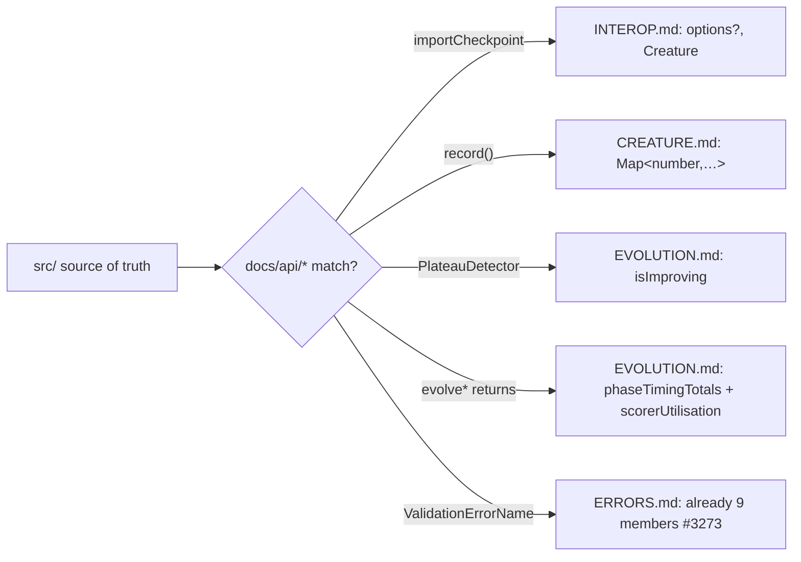

# PR Summary — Issue #3278

## Summary

Several `docs/api/*` reference pages documented method signatures, return shapes
and enum members that had drifted from `src/`, so copy-paste examples would not
type-check and an agent would infer the wrong API surface. This PR reconciles
each cited page against the current source. **Closes #3278.**

Fixes applied:

- **`docs/api/INTEROP.md` — `importCheckpoint` signature.** Changed the heading
  and example from the positional
  `importCheckpoint(checkpoint, inputCount, outputCount)` /
  `importCheckpoint(checkpoint, 8, 3)` to the real
  `importCheckpoint(checkpoint: CheckpointInterface, options?: CheckpointImportOptions): Creature`
  (`src/transfer/Checkpoint.ts:143-146`). The target counts come from
  `options.targetInputCount` / `options.targetOutputCount`
  (`src/transfer/Checkpoint.ts:149-150`). Added a typed options block, a
  corrected example, a parameter table and a `Returns` line.
- **`docs/api/CREATURE.md` — `record()` return type.** Changed the documented
  key from `Map<string, DiscoverRecord>` to `Map<number, DiscoverRecord>`
  (`src/Creature.ts:993`, `src/creature/CreatureTraining.ts:138-141`). The key
  is the runtime neuron `id` — `discoverMap.set(neuron.id, …)` in
  `src/neuron/NeuronRecord.ts:46`.
- **`docs/api/EVOLUTION.md` — `PlateauDetector` method name.** Replaced the
  non-existent `isRapidlyImproving(): boolean` with the real
  `isImproving(): boolean` (`src/NEAT/PlateauDetector.ts:179`;
  `grep -rn isRapidlyImproving src/` is empty).
- **`docs/api/EVOLUTION.md` — `evolveDir()` / `evolveRL()` return shapes.**
  Added the two telemetry fields both functions return —
  `phaseTimingTotals: PhaseTimingTotals` (Issue #3210) and
  `scorerUtilisation: ScorerUtilisationTotals` (Issue #3234) —
  (`src/Creature.ts:1004-1012`, `1060-1067`). Added a **Run telemetry** section
  documenting both interface shapes, mirrored from
  `src/creature/PhaseTimingTotals.ts` and
  `src/creature/ScorerUtilisationTotals.ts`, with a note that the signatures are
  mirrored from `src/`.

### Already correct — no change needed

- **`ValidationErrorName` union (`docs/api/ERRORS.md`).** The issue asked to add
  `NEURON_ORDER` and `DUPLICATE_SYNAPSE`, but the base branch already lists all
  9 members (added by #3273 / PR #3295). Verified against
  `src/errors/ValidationError.ts:10-19`. No edit was made.

## Evidence

Documentation-only change — no web interface to screenshot. Each fix was
verified by reading the cited `src/` locations:

| Doc claim (after fix)                                                 | Source of truth                                                                      |
| --------------------------------------------------------------------- | ------------------------------------------------------------------------------------ |
| `importCheckpoint(checkpoint, options?): Creature`                    | `src/transfer/Checkpoint.ts:143-146`                                                 |
| counts from `options.targetInputCount/targetOutputCount`              | `src/transfer/Checkpoint.ts:149-150`                                                 |
| `record(): Map<number, DiscoverRecord>`                               | `src/Creature.ts:993`; key `neuron.id` at `src/neuron/NeuronRecord.ts:46`            |
| `PlateauDetector.isImproving()`                                       | `src/NEAT/PlateauDetector.ts:179`                                                    |
| `evolveDir/evolveRL` return `phaseTimingTotals` + `scorerUtilisation` | `src/Creature.ts:1004-1012, 1060-1067`                                               |
| `PhaseTimingTotals` / `ScorerUtilisationTotals` shapes                | `src/creature/PhaseTimingTotals.ts:25`, `src/creature/ScorerUtilisationTotals.ts:42` |

Validation:

- `deno fmt --check` on the three changed files — clean.
- `markdownlint-cli2` on the three changed files — no errors (the sole repo-wide
  error is a pre-existing `MD028` in `ERRORS.md:82`, untouched here).

## Test Plan

No automated tests were added. Per `AGENTS.md`, tests that grep or inspect
documentation/source text are explicitly forbidden ("how" tests), and this
change has no runtime behaviour — it only corrects prose/signatures in Markdown
reference pages. Verification is the manual source-cross-check table above plus
the `deno fmt` and `markdownlint` gates.
