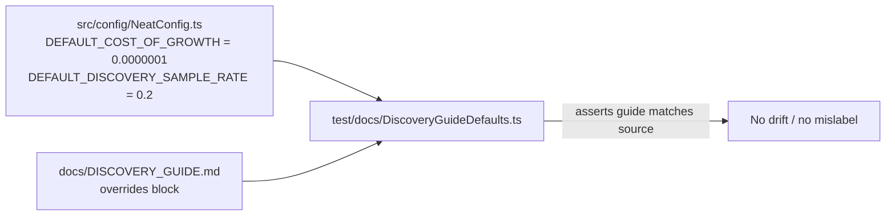

# Fix mislabelled discovery "defaults" in `docs/DISCOVERY_GUIDE.md`

## Summary

The "Production-Tuned Defaults" block in `docs/DISCOVERY_GUIDE.md` reproduced
pre-#1386 discovery values and carried an inline `// Default:` comment that was
~10,000× off the real default, contradicting both source and a sibling
troubleshooting doc. This PR corrects that block. **Closes #3279.**

Verified discrepancies fixed:

- **`costOfGrowth`** — the guide set `costOfGrowth: 0.001` with the comment
  `// Default: candidates must reduce error > 0.001 per synapse`. The real
  default is `DEFAULT_COST_OF_GROWTH = 0.000_000_1`
  (`src/config/NeatConfig.ts`). The comment now names the real default
  (`0.0000001`) and describes the `0.001` line as a deliberate, much-stricter
  **override**.
- **`discoverySampleRate`** — the guide quoted `0.05` as a default; the real
  default is `DEFAULT_DISCOVERY_SAMPLE_RATE = 0.2`. The comment now states the
  `0.2` default and frames `0.05` as an override for faster iteration.
- **Record-timeout comment** — updated to name the real 5-minute default rather
  than the stale 1-minute snapshot.
- The block heading is reframed from **"Production-Tuned Defaults"** to
  **"Production-Tuned Overrides (illustrative)"**, and now links to the
  authoritative [`docs/config/DISCOVERY.md`](../../config/DISCOVERY.md) and
  [`docs/config/CORE_EVOLUTION.md`](../../config/CORE_EVOLUTION.md) tables so
  the example cannot silently drift from source again.

This resolves the doc-vs-doc contradiction: `docs/troubleshooting/DISCOVERY.md`
already states `0.0000001`, so a tuner reading the two docs no longer gets
conflicting growth-penalty guidance.

## Evidence

Documentation-only change — no web UI to screenshot. Correctness is guarded by a
new "what" test that reads the published guide and asserts it against the real
source constants.



Before → after (the offending line):

```diff
- costOfGrowth: 0.001, // Default: candidates must reduce error > 0.001 per synapse
+ // Raise the growth penalty well above the default of 0.0000001 — a much
+ // stricter gate ... costOfGrowth: 0.001
```

## Test Plan

Added `test/docs/DiscoveryGuideDefaults.ts` (Issue #3279), mirroring the
existing `test/docs/ErrorsDocMatchesValidationError.ts` pattern:

- `Discovery defaults in source are the authoritative values` — asserts
  `DEFAULT_COST_OF_GROWTH === 0.0000001` and
  `DEFAULT_DISCOVERY_SAMPLE_RATE ===
  0.2`.
- `DISCOVERY_GUIDE.md never restates the wrong costOfGrowth default` —
  reproduces the bug: fails against the old `// Default: ... 0.001` comment.
- `DISCOVERY_GUIDE.md quotes the correct costOfGrowth default` — requires
  `0.0000001` to appear.
- `DISCOVERY_GUIDE.md reframes the block as overrides, not defaults` — requires
  the misleading heading to be gone.
- `DISCOVERY_GUIDE.md links to the authoritative defaults tables` — requires
  links to `config/DISCOVERY.md` and `config/CORE_EVOLUTION.md`.

All five pass after the fix; four failed against the unfixed doc. Existing
`test/config/ConfigurationGuideDefaults.ts`,
`test/config/MCMCConfigDocumentation.ts`, and `test/docs/*` suites continue to
pass.
