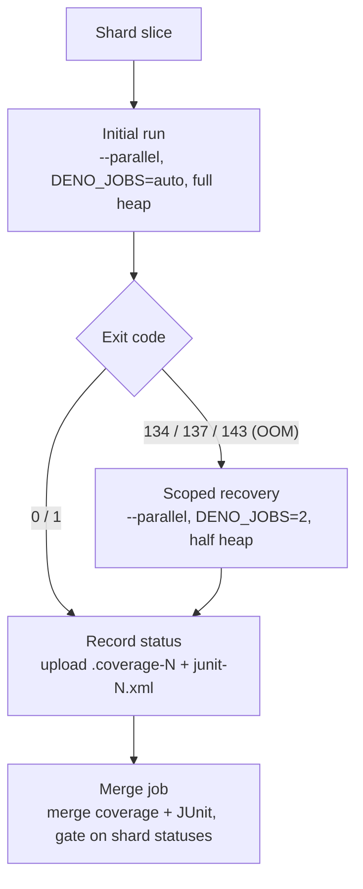

# Correct stale coverage-OOM recovery docs in `docs/troubleshooting/CI.md`

## Summary

`docs/troubleshooting/CI.md` documented the **single-threaded** coverage-shard
OOM recovery that Issue #3174 deliberately **reverted**, and listed the
`quality.sh` steps in the wrong order. The archived summary that recorded _why_
the old behaviour was abandoned (`pr-summary-3174.md`) was a negative learning
at risk of being lost. This PR corrects the documentation to the shipped
behaviour, folds the durable negative learning into CI.md, and deletes the
archived summary now that its learning lives in the maintained doc. Closes
#3280.

Changes:

- **Stale OOM recovery corrected.** The per-shard description and the exit-code
  table now reflect the shipped recovery: it **keeps `--parallel`**, caps the
  worker pool via `DENO_JOBS=2`, and halves the V8 heap — matching
  `.github/workflows/coverage.yaml` and `scripts/coverage_run_plan.ts`
  (`planOomRetry`).
- **Negative learning folded in.** A new "Why the OOM recovery stays parallel"
  section captures the insight from `pr-summary-3174.md`: the OOM is
  **concurrency-driven** (peak ≈ `workers × per-file heap`, ~120–210 MB each),
  so the correct lever is the worker count — the serial single-threaded re-run
  was tried and abandoned because it blew the 60-minute job timeout. A callout
  warns agents debugging a coverage OOM **not** to re-propose the rejected
  serial fallback.
- **`quality.sh` step order fixed.** The list now matches the real order:
  type-check (`deno check`) → discovery library check →
  `./build.sh
  --verify-only` (WASM sync) → tests. The previously-missing
  WASM-sync step is added and the reversed `deno check` / discovery ordering is
  corrected.
- **MEMORY.md cross-reference corrected.** The exit-code-143 note in
  `docs/troubleshooting/MEMORY.md` carried the identical stale "retries with 50%
  memory and no parallelism" claim and is linked from CI.md's "See also"; it now
  describes the parallel `DENO_JOBS=2` recovery so the two docs no longer
  contradict each other.
- **Archived summary deleted.** `docs/archive/pr-summaries/pr-summary-3174.md`
  is removed in this PR (not before), now its learning is captured in CI.md. No
  code or test referenced the file.

## Evidence

Documentation-only change — no web UI to screenshot. Verified that the corrected
text matches the shipped implementation, and that the docs test suite still
passes.

Sources of truth confirmed:

- `.github/workflows/coverage.yaml:134-147` — recovery keeps `--parallel`,
  `RETRY_JOBS=2`, reduced heap.
- `scripts/coverage_run_plan.ts:102-112` — `planOomRetry` returns
  `parallel: true` with `denoJobs: RETRY_DENO_JOBS` (2).
- `quality.sh:231-273` — order: `deno check` → discovery check →
  `./build.sh
  --verify-only` → tests.

Corrected OOM-path pipeline (now documented in CI.md):

## Test Plan

No new "how" tests were added: the project's testing policy (AGENTS.md) forbids
tests that grep documentation content, and the shipped recovery behaviour is
already verified by `test/ci/CoverageRunPlan.ts` (asserts `planOomRetry` stays
parallel with a capped `DENO_JOBS > 1`).

Ran the docs test suite to confirm no regression from the edits and the
deletion:

- `test/docs/JekyllLiquidSafety.ts` — 7 passed (new Mermaid/prose is
  Liquid-safe).
- `test/docs/PrSummaryArchiveLayout.ts` — 2 passed (archive layout intact).
- `test/docs/DocsIndex.ts` — 1 passed (`docs/README.md` links still resolve; the
  deleted summary was not linked).

`deno fmt --check` passes on both edited markdown files.
