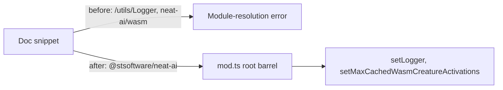

# Fix docs importing from non-existent subpath exports

## Summary

`deno.json` declares `"exports": "./mod.ts"` — a bare string — so the package
exposes exactly one public specifier, the root `@stsoftware/neat-ai`; there are
no `/utils/Logger` or `/wasm` subpaths. Three docs imported from those
non-existent subpaths, so every copy-paste threw a module-resolution error for
an external consumer. Each symbol is already re-exported from the root barrel
(`mod.ts`), so the fix is to import from `@stsoftware/neat-ai`. Closes #3281.

Changes:

- **`AGENTS.md:401`** — `setLogger` now imported from `@stsoftware/neat-ai`
  (merged into the existing `Neat` import), replacing
  `@stsoftware/neat-ai/utils/Logger`.
- **`docs/troubleshooting/MEMORY.md:79`** and
  **`docs/troubleshooting/WASM.md:198`** — `setMaxCachedWasmCreatureActivations`
  now imported from `@stsoftware/neat-ai`, replacing `neat-ai/wasm`.
- Added a short "one entry point" note to each of the three files so future
  examples do not invent subpaths.

The `@utils/` alias in `deno.json` is an internal source alias, not a published
export, and is unaffected. Source-path references such as `src/utils/Logger.ts`
in prose are not imports and were left unchanged.

## Evidence

Documentation/CLI change — no web interface to screenshot. Verified via the new
fact-check test, which imports the symbols from the public entry point and
invokes them exactly as the corrected docs show, then asserts the docs no longer
reference the broken subpaths:

```
running 3 tests from ./test/docs/RootImportSpecifiers.ts
mod.ts re-exports setLogger (AGENTS.md logging example) ... ok
mod.ts re-exports setMaxCachedWasmCreatureActivations (troubleshooting example) ... ok
docs import these symbols from the root specifier, not a subpath ... ok

ok | 3 passed | 0 failed
```



## Test Plan

- Added `test/docs/RootImportSpecifiers.ts`:
  - `setLogger` imported from `mod.ts` and exercised (custom logger receives the
    call).
  - `setMaxCachedWasmCreatureActivations` imported from `mod.ts` and its effect
    asserted via `getMaxCachedWasmCreatureActivations`.
  - Regression guard scanning `AGENTS.md`, `docs/troubleshooting/MEMORY.md`, and
    `docs/troubleshooting/WASM.md` for the forbidden subpath specifiers
    (`@stsoftware/neat-ai/utils/Logger`, `neat-ai/wasm`) — fails against the
    unfixed docs, passes after the fix.
- Ran `deno fmt`, `deno lint`, `deno check` on the new test (clean) and the
  existing `test/docs` suite (all pass).
