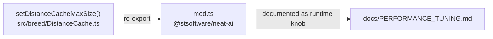

# Fix drifted performance & troubleshooting docs (Issue #3282)

## Summary

`docs/PERFORMANCE_TUNING.md` and the `docs/troubleshooting/*` performance docs
had drifted from source — documenting a config key that does not exist, a
WASM-cache default a real run never sees, and a build path/command that is gone.
This PR realigns each claim with the source of truth. Closes #3282.

| Claim | Was | Now | Source of truth |
| ----- | --- | --- | --------------- |
| Distance-cache size | `distanceCache.maxSize` config option (default `10000`) | Not a `NeatOptions`/`NeatConfig` field; runtime `setDistanceCacheMaxSize()` call, default `10_000` | `src/breed/DistanceCache.ts:15,94`; zero `distanceCache` hits in `src/config/` |
| WASM activation-cache default | "Default: 512" (MEMORY.md, WASM.md) | Effective default `populationSize * 2`; `512` labelled as the low-level module fallback | `src/config/parsers/RuntimeParsers.ts:56-59`; `src/wasm/WasmCreatureActivationLRU.ts:51` |
| `threads` default | `navigator.hardwareConcurrency` | `navigator.hardwareConcurrency + 2` | `src/config/NeatConfig.ts:239-240`, `DEFAULT_HEAVY_TASK_WORKER_COUNT = 2` |
| WASM build command | `cd wasm_activation && ./build.sh` (from source) | Repo-root `./build.sh`, described as syncing the vendored NEAT-AI-core bundle | `build.sh` header; no `wasm_activation/build.sh` exists |

### Enabling change — public export

The docs now describe tuning the distance cache via `setDistanceCacheMaxSize()`.
That setter previously lived only in `src/breed/DistanceCache.ts` and was **not**
re-exported from the single public entry point (`mod.ts`), so the documented call
would not have been reachable by consumers. It is now re-exported from `mod.ts`,
exactly mirroring the already-public `setMaxCachedWasmCreatureActivations()` WASM
cache setter, so the documentation is truthful.

## Evidence

Documentation + a one-line public-export change — no web UI to screenshot. The
export is verified by a unit test that imports the setter from the public
`mod.ts` barrel and asserts it bounds the cache; the full `./quality.sh` gate
passes (7591 tests, 0 failed).

## Test Plan

- Added `test/breed/DistanceCache.ts::DistanceCache - setDistanceCacheMaxSize is
  re-exported from mod.ts and bounds the cache` — imports the setter from the
  public `mod.ts` entry point, sets a small bound, inserts more entries than the
  bound, and asserts LRU eviction keeps the cache within `maxSize`.
- `./quality.sh` passes cleanly (lint, format, type-check, WASM sync, all tests).
