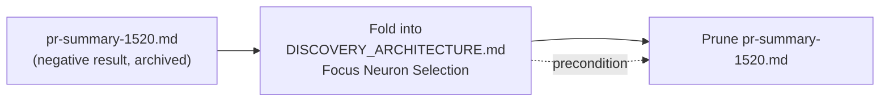

# Fold pr-summary-1520 negative remove-neuron gain result into DISCOVERY_ARCHITECTURE

## Summary

`docs/archive/pr-summaries/pr-summary-1520.md` recorded a durable **negative
result** that lived nowhere in the main docs: a locally-synthesised
remove-neuron gain heuristic was topology-blind and produced a badly wrong
estimate (`+0.17882921` claimed vs `−0.000194` measured for the
`neuron-1802938338` failure — ~920× too large and opposite in sign). This PR
folds that learning into `docs/DISCOVERY_ARCHITECTURE.md`, then prunes the
archived summary. The capture is the precondition for the deletion — the
learning is not dropped. Closes #3284.

- Added a **🧮 Remove-neuron gain estimation (propagation-aware, Rust-owned)**
  subsection under _Focus Neuron Selection_ in `docs/DISCOVERY_ARCHITECTURE.md`,
  stating plainly that remove-neuron gain is estimated by the propagation-aware
  Rust `estimate_remove_neuron_gain`, never a JS-local heuristic, and that an
  unwired estimate emits a non-fabricated neutral `0`.
- Preserved the exact failure numbers in a `[!CAUTION]` **Negative result**
  callout ("do NOT resurrect a local squash-error gain heuristic"), including
  the old topology-blind formula, so a future contributor cannot re-introduce
  it.
- Noted that gain and removal-eligibility are separate: over-threshold neurons
  are still promoted for removal on error magnitude alone.
- Added a `#3284` entry to the **Related Issues** list.
- Deleted `docs/archive/pr-summaries/pr-summary-1520.md` (no in-repo references
  remained outside the file itself).

## Evidence

Documentation-only change — no web interface to screenshot. Verified with
`./quality.sh --lint-only` (formatting, linting across 1785 files, and bash
syntax) — all green. A grep across `README.md`, `AGENTS.md`, and `docs/**`
(excluding the archive) previously found no mention of remove-neuron gain, the
estimator, or the failure; that learning now lives in a durable doc.

## Test Plan

No code changed, so no unit tests were added — this is a pure documentation
absorption. Validation was via `./quality.sh --lint-only`:

- `deno fmt` — 2078 files checked, no reformatting of the edited doc.
- `deno lint` — 1785 files, clean.
- Bash syntax check — all scripts pass.
