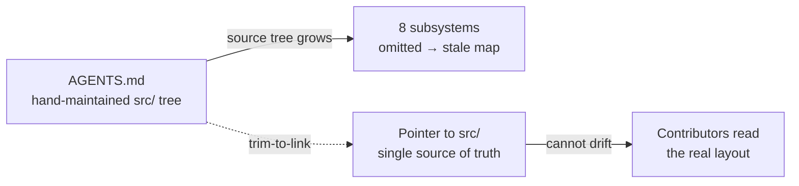

# AGENTS.md Directory Structure — trim the stale hand-maintained `src/` tree

## Summary

The "Directory Structure" section of `AGENTS.md` embedded a hand-maintained
per-module `src/` tree that had drifted from the real source layout. Eight live
subsystems existed under `src/` but were **absent** from the tree — `cache/`,
`neuron/`, `onnx/`, `predictiveCoding/`, `presets/`, `score/`, `transfer/`,
`workers/` — several of them load-bearing (ONNX export, predictive coding,
presets, transfer learning). A contributor trusting the map would conclude those
subsystems did not exist.

Per the audit's preferred fix, the drift-prone per-module `src/` enumeration is
removed and replaced with a pointer to `src/` as the single source of truth that
cannot rot. The stable top-level directory list is retained. `Closes #3285`.

## Evidence

Documentation/CLI change — no web interface to screenshot. Verified via a new
behavioural regression test that reads the real `src/` layout and the AGENTS.md
section:

- Before the fix: `21/29` subsystems listed, omitting the 8 live subsystems →
  test fails (reproduces #3285).
- After the fix: the section names no individual subsystem and points to `src/`
  → test passes.

Full quality gate (`./quality.sh`) passes cleanly: `7593 passed | 0 failed`.

## Test Plan

- Added `test/docs/AgentsDirectoryStructure.ts`:
  - `AGENTS.md Directory Structure does not embed a partial src/ module tree` —
    reads live `src/` subdirectories and asserts the section lists all-or-none,
    so a subset that silently omits new subsystems cannot creep back in.
  - `AGENTS.md Directory Structure points to src/ as source of truth` — asserts
    the section references `src/` as the authoritative layout.
