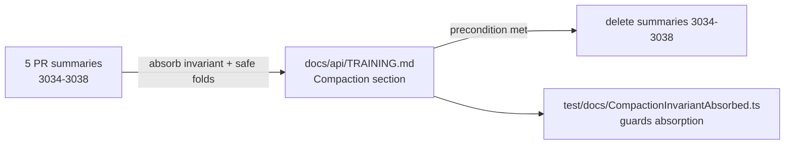

# Fold the safe/aggressive compaction invariant into TRAINING.md

## Summary

A load-bearing design invariant for two-variant network compaction lived only
across five PR summaries and in no durable doc. This PR captures it once in
`docs/api/TRAINING.md`, then deletes the now-absorbed summaries. Closes #3286.

A new **🗜️ Compaction** section in `docs/api/TRAINING.md` states the invariant:

- Compaction produces **two candidates** — **safe** (only exact,
  behaviour-preserving folds; score guaranteed `≥` original) and **aggressive**
  (safe folds plus a speculative low-`|weight|` synapse prune at
  `AGGRESSIVE_PRUNE_WEIGHT_THRESHOLD = 1e-3`, purely structural and
  **dataset-free**).
- Selection via `selectCompactVariant()` is **score-gated**, and because the
  safe variant is the floor **the aggressive gamble can never cost anything**.
- The **safe folds** are enumerated: constant fold into additive consumers;
  transitive fold to a fixpoint plus zero-varying-input collapse; and exact
  `IF`-collapse when all condition inputs are constant.
- Two explicit "do not" rules record why the rationale matters: do not add a
  training-data threshold to the aggressive prune, and do not drop the safe
  floor — either change silently voids the "costs nothing" guarantee.

**Only after** the capture landed, `pr-summary-3034.md` … `pr-summary-3038.md`
were deleted (the capture is the precondition for deletion).

## Evidence

Documentation-only change — no web interface to screenshot. Verified by a new
"what" test (matching the existing `test/docs/PrSummaryArchiveLayout.ts`
convention) that walks the real filesystem: it asserts the invariant text and
safe folds are present in `TRAINING.md` and that the five summaries are gone.

- `deno test --allow-read test/docs/CompactionInvariantAbsorbed.ts` → 2 passed.
- `deno fmt --check` and `deno lint` clean on the edited files.
- Full `./quality.sh` ran fmt/lint/type-check + the suite: **7594 passed**. The
  only failure was `test/creature/FitnessSubsampleEvaluateDir.ts` — a
  pre-existing parallel-execution flake unrelated to this docs-only change; it
  passes deterministically when run in isolation
  (`deno test test/creature/FitnessSubsampleEvaluateDir.ts` → 3 passed).

## Test Plan

Added `test/docs/CompactionInvariantAbsorbed.ts`:

- `TRAINING.md captures the safe/aggressive compaction invariant (#3286)` —
  asserts the "aggressive gamble can never cost anything" invariant,
  `compactVariants`/`selectCompactVariant`, the `1e-3` threshold constant,
  `dataset-free`, and each enumerated safe fold are present (whitespace- and
  blockquote-normalised so it is robust to prose reflow).
- `absorbed compaction PR summaries are deleted (#3286)` — asserts
  `pr-summary-3034.md` … `pr-summary-3038.md` no longer exist under
  `docs/archive/pr-summaries/`.
