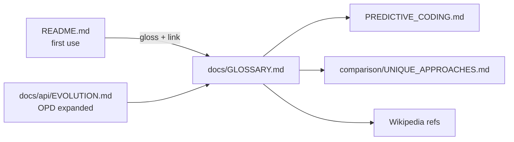

## Summary

The README bills `docs/GLOSSARY.md` as "the canonical reference for **every**
acronym and house term used here", yet three terms it front-loads were defined
nowhere the reader is pointed to: **predictive coding**, **Muon-style
orthogonalised gradients**, and **OPD** (On-Policy Distillation). This closed
the gap between the promise and the glossary. Closes #3287.

Changes:

- **`docs/GLOSSARY.md`**
  - Added an **OPD — On-Policy Distillation** row to the acronyms table, linking
    Knowledge distillation and the Specialist Pipeline in `api/EVOLUTION.md`.
  - Added themed-term entries for **Predictive coding** (links Wikipedia and
    `PREDICTIVE_CODING.md`) and **Muon-style orthogonalised gradients** (links
    orthogonalisation, notes the opt-in `gradientOrthogonalisation: "muon"`, and
    points to `comparison/UNIQUE_APPROACHES.md`).
- **`docs/api/EVOLUTION.md`** — expanded OPD on first use to "OPD (On-Policy
  Distillation)" and linked the glossary entry.
- **`README.md`** — glossed the two terms where they first appear (line 12):
  linked `predictive coding` → `docs/PREDICTIVE_CODING.md` and
  `Muon-style orthogonalised gradients` →
  `docs/comparison/UNIQUE_APPROACHES.md`, and reaffirmed the glossary as the
  lookup for every house term/acronym.

## Evidence

Documentation-only change — no web interface to screenshot. Verified via the
existing behavioural link-resolution and doc tests:

- `deno test test/docs/GlossaryAndStyle.ts` — glossary internal links resolve
  (covers the three new link targets).
- `deno test test/docs/DiscoveryGuides.ts test/docs/ConfigDocsExports.ts
  test/docs/ErrorsDocMatchesValidationError.ts test/docs/DocsIndex.ts`
  — 16 passed / 0 failed.
- `./quality.sh --lint-only` — formatting, linting, and bash checks pass (exit
  0). `markdownlint-cli2` reports no errors in the three edited files.

Per Issue #3142 the glossary's prose-grep assertions (required-acronym /
themed-term substring checks) were deliberately removed as editorial, so no new
prose-grep test was added; the observable behaviour here is that the new
first-use links resolve, which the existing link-resolution test verifies.

## Test Plan

- Ran `test/docs/GlossaryAndStyle.ts` (link resolution) — passes with the three
  new glossary links.
- Ran the wider `test/docs/*` suite — 16 passed / 0 failed.
- Ran `./quality.sh --lint-only` — exit 0.
- Ran `markdownlint-cli2` on the edited files — no errors.
