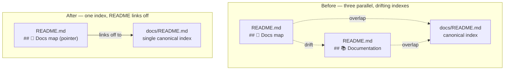

# PR Summary — Issue #3288

## Summary

`README.md` maintained **two** overlapping documentation indexes in the same
file — `## 📖 Docs map` and `## 📚 Documentation` — while a third, canonical
index already lived in `docs/README.md`. The two README blocks duplicated the
same guides and had **already drifted apart** (each linked docs the other
omitted). Three parallel indexes of the same guides cannot stay in sync, so a
reader got a different, incomplete picture depending on which block they
scrolled to, and every new doc had to be remembered in three places.

This PR makes `docs/README.md` the single source of truth for the topic-by-topic
index and reduces the README to a pointer:

- **Trimmed `## 📖 Docs map`** to a short pointer that defers to
  `docs/README.md`, plus a handful of top entry-point links (`CONTRIBUTING.md`,
  `AGENTS.md`, `Glossary`, `COMPARISON.md`). The inline "Topic guides"
  sub-catalogue that duplicated `docs/README.md` was removed.
- **Deleted the second `## 📚 Documentation` catalogue** entirely. Every guide
  it listed is already indexed in `docs/README.md`.
- No other README content changed; contextual links inside feature prose (e.g.
  the Discovery and Predictive Coding references) are untouched.

Closes #3288.

## Evidence

This is a documentation + test change with no web interface to screenshot.
Verification is via the new behavioural tests and the existing docs suite.

Before → after structure:



Test run:

```
running 4 tests from ./test/docs/ReadmeSingleDocsIndex.ts
README relative links all resolve on disk ... ok
README defers to the canonical docs/README.md index ... ok
README no longer carries a second '## 📚 Documentation' catalogue ... ok
README Docs map is a pointer, not a duplicate catalogue ... ok
ok | 4 passed | 0 failed
```

The full `test/docs/` suite (102 tests) passes, confirming no other doc test
relied on the removed README catalogue. `deno fmt --check` and `deno lint` pass
on the changed files.

## Test Plan

Added `test/docs/ReadmeSingleDocsIndex.ts` — behavioural ("what") tests that
read the committed Markdown and assert on observable facts:

- **README relative links all resolve on disk** — guards against broken links
  introduced by the edit.
- **README defers to the canonical docs/README.md index** — the single
  `Docs
  map` section links to `docs/README.md`.
- **README no longer carries a second `## 📚 Documentation` catalogue** — the
  regression guard; this test failed against the pre-fix README and passes now.
- **README Docs map is a pointer, not a duplicate catalogue** — the README links
  to fewer `docs/` guides than the canonical index, i.e. it does not
  re-catalogue the guides `docs/README.md` owns.
