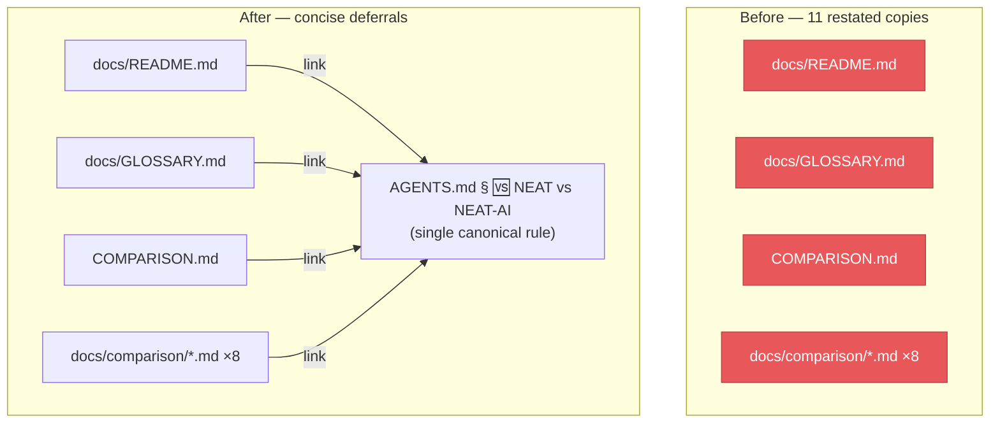

# De-duplicate the "NEAT-AI ≠ NEAT" terminology admonition (Issue #3289)

## Summary

The full "NEAT-AI ≠ NEAT" `> [!IMPORTANT]` admonition was restated in **11 live
(non-archive) docs**, each maintaining its own copy of a rule the project
declares canonical in `AGENTS.md` § "🆚 NEAT vs NEAT-AI — which term to use".
Eleven copies of the same normative paragraph drift apart over time — one gets
clarified, the others do not — and bloat every comparison doc with boilerplate.

Following the model already used by the root `README.md`, each of the 11
callouts is now a single concise one-line summary that **links** to the one
canonical rule instead of restating it. `AGENTS.md` remains the single source of
truth; every other doc defers to it.

Files updated (all 11 named in the issue):

- `docs/README.md`, `docs/GLOSSARY.md`, `COMPARISON.md`
- `docs/comparison/`: `ARCHITECTURES.md`, `ECOSYSTEM.md`,
  `TRAINING_PARADIGMS.md`, `PROS_AND_CONS.md`, `IMPLEMENTED.md`,
  `UNIQUE_APPROACHES.md`, `FUTURE_WORK.md`, `REFERENCES.md`

Each callout keeps the correct relative path to the canonical anchor
(`../AGENTS.md`, `./AGENTS.md`, or `../../AGENTS.md` depending on the doc's
location).

Closes #3289.

## Evidence

Docs-only change — no web interface to screenshot. Verified by the new
behavioural test plus the existing doc test suite (link resolution, Jekyll
Liquid safety, glossary/style) and the full `./quality.sh` gate (fmt, lint,
type-check, 7597 tests) passing cleanly (exit 0).

New test `test/docs/NeatTerminologyDefersToCanonical.ts` reproduced the defect
before the fix — it failed on `docs/README.md` (and the other docs that
re-embedded the 2002 paper citation) and passes after each callout was reduced
to a concise deferral.

A strict prose/line-count assertion on the summary wording was deliberately
avoided: issue #3142 removed exactly that class of "callout wording" grep from
`test/docs/ComparisonSplit.ts` because it broke on any reword. The new test
instead guards the durable structural invariant — every governed doc's
terminology callout links to the canonical anchor and does **not** re-cite the
founding paper — so it catches the duplication returning without breaking on a
future reword of the one-line summary.

## Test Plan

- Added `test/docs/NeatTerminologyDefersToCanonical.ts`:
  - `AGENTS.md is the single canonical home of the NEAT vs NEAT-AI rule` —
    asserts the canonical heading exists so the anchor the other docs link to
    resolves.
  - `governed docs defer to the canonical NEAT vs NEAT-AI rule` — for each of
    the 11 docs, asserts the terminology callout exists, links to the canonical
    anchor, and does not re-cite the Stanley & Miikkulainen (2002) paper.
- Confirmed the second test failed against the pre-fix docs and passes after.
- Ran `test/docs/ComparisonSplit.ts`, `DocsIndex.ts`, `GlossaryAndStyle.ts`,
  `DiscoveryGuides.ts`, `JekyllLiquidSafety.ts` — all pass.
- Ran the full `./quality.sh` gate — exit 0, 7597 passed / 0 failed.
