# PR Summary — Issue #3313

## Summary

Dropped the unused `export` keyword from `removeKnownSign` in
`src/optimize/Simplify.ts`, making the helper module-private. A word-boundary
search across every `.ts` file confirms the symbol is referenced **only** inside
`Simplify.ts` — declared at line 146 and called once internally from `simplify()`
at line 91. It is not re-exported from `mod.ts`, has no importer in any other
module, and no non-`.ts` file (nor any dynamic `import()`) references the name.
The `export` therefore added public API surface with no consumer. Removing it
keeps behaviour identical while shrinking the public surface. Closes #3313.

```mermaid
flowchart LR
    subgraph Before
        A1[simplify&#40;&#41;] --> B1[removeKnownSign<br/>exported — no consumer]
    end
    subgraph After
        A2[simplify&#40;&#41;] --> B2[removeKnownSign<br/>module-private]
    end
```

## Evidence

Backend/library change with no web interface to screenshot. Verification is by
the existing behaviour tests that exercise the `removeKnownSign` path through the
public `simplify()` entry point:

- `test/optimize/simplify/ABSOLUTE.ts` drives an `ABSOLUTE`/`ReLU` chain through
  `simplify()` (the branch that invokes `removeKnownSign`) and asserts
  activation output is preserved across 12 input patterns.
- The full `test/optimize/simplify/` suite (ABSOLUTE, IDENTITY, Constant,
  COMPLEMENT, and others) passes: **12 passed | 0 failed**.
- `deno check` and `deno lint` on the modified file are clean.

### Pre-existing, unrelated quality-gate failures

The full `./quality.sh` run reported 2 failures, both in subsystems untouched by
this one-line change and confirmed to fail on the base branch **without** it:

- `test/ErrorGuidedStructuralEvolution/NeuronDiscoveryIntegration.ts` — a
  `mapRustCoordinatedOp` exhaustiveness bug (`Unhandled variant: setBias`),
  already tracked separately (see branch `fix/3190-mapRustCoordinatedOp-exhaustiveness`).
- `test/score/RustScorerBridgeHardening.ts` — a flaky `TMPDIR` temp-file
  environment test that passes when run in isolation.

Neither touches `src/optimize/`; both are outside the scope of this issue.

## Test Plan

- Ran `deno test test/optimize/simplify/` (ABSOLUTE, IDENTITY, Constant,
  COMPLEMENT) — all pass, confirming `simplify()`/`removeKnownSign` behaviour is
  unchanged after the export was removed.
- Ran `deno check` and `deno lint` on `src/optimize/Simplify.ts` — clean.
- No new test added: the change removes dead public surface only; asserting the
  absence of an `export` would be a source-grep "how" test, which the project
  testing policy forbids. The behaviour that used the helper is already covered
  by the existing `simplify()` tests above.
