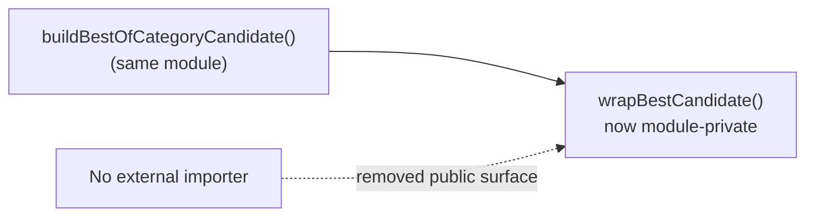

# Remove dead `export` on `wrapBestCandidate` (Issue #3314)

## Summary

`wrapBestCandidate` in `src/discovery/CombinedCandidates.ts` was exported but
had no importer anywhere in the repository — it is called only from within its
own module (by `buildBestOfCategoryCandidate`). The `export` keyword added
public API surface with no consumer, so it has been dropped, making the helper
module-private. Behaviour is unchanged. Closes #3314.

Verification that the removal is safe:

- A word-boundary search for `wrapBestCandidate` across every `.ts` file finds
  occurrences **only** in `src/discovery/CombinedCandidates.ts` (declaration
  plus three internal call sites).
- The helper is **not** re-exported from `mod.ts` nor from the
  `DiscoveryCandidates.ts` backwards-compatibility barrel.
- No dynamic `import()` or reflective use targets the name; no non-`.ts` file
  references it.

## Change

- `src/discovery/CombinedCandidates.ts` — removed the `export` keyword from
  `function wrapBestCandidate` and noted in the doc comment that it is now
  module-private (Issue #3314). The three internal call sites are unchanged.

## Evidence

Backend-only change with no web interface, so no screenshot applies.

The helper's selection logic (picking the top-scoring candidate) is already
covered behaviourally through the public `buildDiscoveryCandidates` path by the
existing test suite — dropping the `export` keeps that coverage green, which is
the regression guarantee. A new test asserting "the symbol is not exported"
would be a forbidden "how" test (it inspects API surface rather than
behaviour), so none was added.

- Targeted run — `test/discovery/DiscoveryCandidatesIndividual.ts`:
  `7 passed | 0 failed`, including
  `buildDiscoveryCandidates combines best candidate from each category` and
  `buildDiscoveryCandidates includes removeHarmfulNeurons in best-of-category
  candidate`, both of which exercise `wrapBestCandidate` via
  `buildBestOfCategoryCandidate`.
- `deno check` and `deno lint` on the affected modules: clean.
- Full `./quality.sh`: `7601 passed (5 steps) | 0 failed | 4 ignored`.

## Test Plan

- No new tests added (see Evidence — a non-exportedness assertion would be a
  "how" test). Existing behavioural coverage in
  `test/discovery/DiscoveryCandidatesIndividual.ts` verifies the helper's
  selection logic through the public API and continues to pass.
- Ran the full quality gate (`./quality.sh`) — lint, format, type-check, and
  all tests pass.
