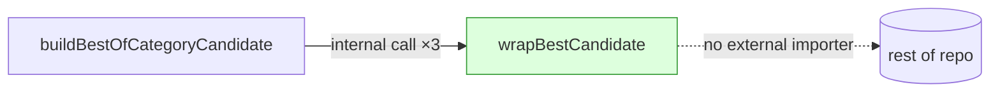

# dead-code: make `wrapBestCandidate` module-private

## Summary

Removed the `export` keyword from the generic helper `wrapBestCandidate` in
`src/discovery/CombinedCandidates.ts`, keeping it module-private. The helper is
called only from within its own module (by `buildBestOfCategoryCandidate`) and
has no importer anywhere in the repository, so the `export` added public API
surface with no consumer. Behaviour is unchanged — the three internal call sites
are untouched. Closes #3314.

## Verification of safety

- A word-boundary search for `wrapBestCandidate` across the repo finds
  occurrences **only** in `src/discovery/CombinedCandidates.ts` (the declaration
  plus three internal call sites). No other `.ts` file imports or re-exports it.
- `DiscoveryCandidates.ts` re-exports several symbols from
  `CombinedCandidates.ts` but never `wrapBestCandidate`; `mod.ts` does not
  expose it either.
- No dynamic `import()` or reflective use targets the name.



## Evidence

Backend/CLI change with no web interface — no screenshot applicable.

The helper's selection behaviour is exercised transitively through
`buildBestOfCategoryCandidate` by the existing behavioural tests in
`test/discovery/DiscoveryCandidatesIndividual.ts`:

- `buildDiscoveryCandidates combines best candidate from each category`
- `buildDiscoveryCandidates includes removeHarmfulNeurons in best-of-category candidate`

Both assert that the highest-scoring entry from each discovery category is
selected — the exact job of `wrapBestCandidate`. Both still pass after dropping
the `export`, confirming the change preserves behaviour:

```
ok | 7 passed | 0 failed (110ms)
```

`deno check` and the full `./quality.sh` gate pass cleanly.

## Test Plan

- No new test needed: removing an `export` keyword changes only module
  visibility, not runtime behaviour. Asserting a symbol is "not importable"
  would be a forbidden "how" test (grepping the module surface). The existing
  behavioural tests above already exercise the helper end-to-end via its sole
  caller and continue to pass.
- Ran `deno test test/discovery/DiscoveryCandidatesIndividual.ts` → 7 passed.
- Ran `./quality.sh` → passes.
