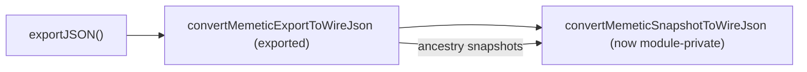

## Summary

Removed the redundant `export` keyword from `convertMemeticSnapshotToWireJson`
in `src/creature/MemeticWireExport.ts`, making it module-private. The function
has no importer anywhere in the repository — a word-boundary search finds it only
in its own module (declaration plus two internal call sites at lines 122 and
125). It is not re-exported from `mod.ts` and no dynamic `import()` or test
references it, so dropping `export` removes dead public surface while keeping
behaviour identical. Closes #3315.

## Evidence

Backend/CLI change only — no web interface to screenshot.

- Verified no external reference before editing:
  `grep -rn "convertMemeticSnapshotToWireJson" --include="*.ts" .` returns only
  the three occurrences inside `MemeticWireExport.ts`.
- The function stays live: it is reachable through the exported
  `convertMemeticExportToWireJson`, which the public `exportJSON()` /
  `exportJSONWithRuntimeIds()` paths call for both the top-level snapshot and
  every ancestry snapshot.
- Full quality gate passes: `./quality.sh` → `7601 passed | 0 failed`.

## Test Plan

No new test is added: the change removes public surface without altering
behaviour, and a test that imported the now-private symbol would contradict the
fix. Existing behaviour tests in
`test/creature/MemeticExportSingleClone.ts` already exercise the function
end-to-end via the public export path and continue to pass:

- `exportJSON: wire memetic is independent of live creature.memetic`
- `exportJSONWithRuntimeIds: memetic is independent of live creature.memetic`
- `exportJSON → fromJSON round-trip preserves memetic values`
