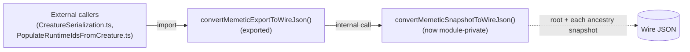

# Remove dead `export` on `convertMemeticSnapshotToWireJson` (Issue #3315)

## Summary

`convertMemeticSnapshotToWireJson` in `src/creature/MemeticWireExport.ts` was
exported but has **no importer anywhere in the repo** — it is only called from
within its own module by `convertMemeticExportToWireJson` (lines 122 and 125).
The `export` keyword added public API surface with no consumer.

This PR drops the `export` keyword, making the helper module-private. Behaviour
is identical: the internal call sites are unchanged, and the genuine public
entry point (`convertMemeticExportToWireJson`) stays exported and keeps working
for its real consumers (`CreatureSerialization.ts`,
`PopulateRuntimeIdsFromCreature.ts`).

Verified before editing that nothing else references the symbol — a
word-boundary search across every `.ts`/`.js`/`.json`/`.md` file finds
occurrences only in `MemeticWireExport.ts`, there is no `export *` barrel, no
`mod.ts` re-export, and no dynamic `import()` targets it.

Closes #3315.

## Evidence

Backend/library change only — no web interface to screenshot. Verified via the
test suite: the public `convertMemeticExportToWireJson` path (which calls the
now-private helper) produces identical wire JSON for the root snapshot and every
ancestry snapshot, and does not mutate the live `creature.memetic`.



Test output:

```
running 3 tests from ./test/creature/MemeticWireExport.ts
convertMemeticExportToWireJson: root snapshot uses wire UUIDs ... ok
convertMemeticExportToWireJson: ancestry snapshots are converted too ... ok
convertMemeticExportToWireJson: deep-clones — live creature.memetic untouched ... ok
ok | 3 passed | 0 failed
```

## Test Plan

- Added `test/creature/MemeticWireExport.ts` with three "what" tests exercising
  the public `convertMemeticExportToWireJson` entry point:
  - root snapshot biases keyed by wire UUID strings and weights as
    `{ fromUUID, toUUID, weight }` rows;
  - ancestry snapshots receive the same wire conversion;
  - the conversion deep-clones and never mutates the live `creature.memetic`.
- Existing `test/creature/MemeticExportSingleClone.ts` (3 tests) continues to
  pass, confirming behaviour is unchanged.
