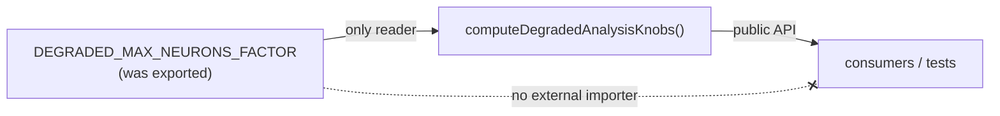

# dead-code: make `DEGRADED_MAX_NEURONS_FACTOR` module-private

## Summary

The exported constant `DEGRADED_MAX_NEURONS_FACTOR` in
`src/architecture/ErrorGuidedStructuralEvolution/AnalysisDegradeDecision.ts` was
read **only** within its own module (the quarter focus-breadth reduction inside
`computeDegradedAnalysisKnobs`). A word-boundary search across every `.ts` file
found no importer or re-export anywhere in the repo, so the `export` keyword
added public surface with no consumer.

This PR drops the `export` keyword, keeping the constant module-private. Its
single internal read is unchanged, so behaviour is identical — only dead public
surface is removed. `Closes #3317`.

## Evidence

Backend/CLI change with no web interface to screenshot. Verified via the test
suite and quality gate:

- `deno test test/ErrorGuidedStructuralEvolution/AnalysisDegradeDecision.ts` — 7
  passed / 0 failed.
- `./quality.sh --lint-only` and `./quality.sh --check-only` — clean
  (formatting, lint, bash syntax, and full-tree `deno check` all pass,
  confirming no broken imports anywhere).

The constant feeds only the public function; consumers reach its effect through
`computeDegradedAnalysisKnobs`, never the constant directly — so it is safe to
keep private.

## Test Plan

- Added `test/ErrorGuidedStructuralEvolution/AnalysisDegradeDecision.ts::`
  `"computeDegradedAnalysisKnobs: applies the quarter focus-breadth factor observably"`
  — pins the 0.25 factor through the public API (`discoveryMaxNeurons: 100` →
  `ceil(100 * 0.25) = 25`), guarding the now-private constant's value observably
  rather than by importing it.
- Existing tests in the same file (quarter reduction, chunk bounding, floors,
  non-finite fallback) continue to pass — none imported the removed export.
