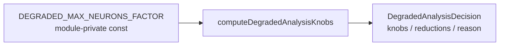

## Summary

Removed the redundant `export` keyword from the module-private constant
`DEGRADED_MAX_NEURONS_FACTOR` in
`src/architecture/ErrorGuidedStructuralEvolution/AnalysisDegradeDecision.ts`.

A word-boundary search across every `.ts` file confirmed the constant is read
**only** within its own module (declaration at line 63, single internal read at
line 102). No other module imports or re-exports it, no test references it, and
`mod.ts` does not surface it. The `export` therefore added public API surface
with no consumer. Dropping the keyword keeps behaviour identical while removing
dead public surface. Closes #3317.

## Evidence

Backend/CLI change only — no web interface to screenshot.

The constant's numeric effect (`0.25` quarter factor) is already exercised
behaviourally by the existing suite:
`computeDegradedAnalysisKnobs({ discoveryMaxNeurons: 16, ... })` asserts
`ceil(16 * 0.25) === 4`. Making the constant module-private does not change any
output, so the whole suite stays green.

Verification:

- `grep -rn "DEGRADED_MAX_NEURONS_FACTOR" --include="*.ts" .` → matches only in
  `AnalysisDegradeDecision.ts` (lines 63 and 102).
- `deno lint` on the edited file → clean (no unused-locals).
- Targeted test file → `6 passed | 0 failed`.

## Test Plan

- Ran `test/ErrorGuidedStructuralEvolution/AnalysisDegradeDecision.ts` — all 6
  existing tests pass, confirming the degrade decision behaviour (including the
  `0.25` factor) is unchanged.
- Ran the full `./quality.sh` gate (lint, format, type-check, WASM sync, full
  test suite) to confirm no importer elsewhere breaks.

No tests were added: the change is a pure visibility reduction with no new
behaviour, and the existing tests already cover the factor's effect through
`computeDegradedAnalysisKnobs`.
