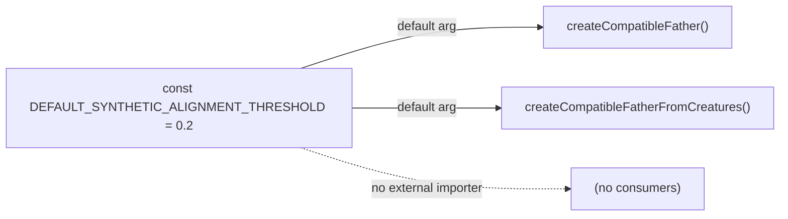

## Summary

Removed the unused `export` keyword from the module-private constant
`DEFAULT_SYNTHETIC_ALIGNMENT_THRESHOLD` in `src/breed/Father.ts`. A
word-boundary search across every `.ts` file in the repo confirms the constant
is referenced **only** within `Father.ts` — its declaration (line 21) and two
internal uses as default parameter values (`createCompatibleFather` and
`createCompatibleFatherFromCreatures`). No other module imports or re-exports
it, `mod.ts` does not surface it, and no test references it. Dropping the
`export` keyword removes dead public surface while preserving behaviour: the two
default-argument uses are unchanged, so the default alignment threshold of `0.2`
still applies to callers that omit the option.

Closes #3318.

## Evidence

Backend/library change with no web interface to screenshot. Behaviour
preservation was verified by running the existing breed tests that exercise the
synthetic-alignment default path:

```
deno test -A test/breed/SyntheticLocationFatherAlignment.ts test/breed/Father.ts
ok | 12 passed | 0 failed (267ms)
```

`./quality.sh --lint-only` passes (format + lint + bash check), and
`deno check src/breed/Father.ts` type-checks cleanly.



## Test Plan

- Ran existing `test/breed/SyntheticLocationFatherAlignment.ts` (6 tests) and
  `test/breed/Father.ts` (6 tests) — all pass, confirming the default threshold
  behaviour is unchanged after the constant became module-private.
- No new test added: the change removes public surface only; the default-value
  behaviour is already covered by the above suites, and importing the
  now-private constant in a test would contradict the change.
- `./quality.sh --lint-only` and `deno check` pass.
