# Fix silent JSR provenance failure — next release carries a Sigstore attestation

## Summary

`@stsoftware/neat-ai` v5.8.0 and v5.8.1 were published to JSR with OIDC
(`id-token: write`) granted, yet both recorded **no Sigstore provenance**
(`rekorLogId: null`). The publish pipeline was silently failing to attest.

**Root cause.** `.github/workflows/publish.yml` published with
`npx jsr publish`. The `jsr` npm CLI is a thin shim: it downloads its **own
pinned Deno binary** into `.download/` and delegates to `deno publish`,
completely bypassing the Deno 2.x that `setup-deno` already installs in the job.
Provenance behaviour is therefore governed by that pinned, indirect binary —
which produced no transparency-log entry for v5.8.0/v5.8.1. (Verified against
the jsr-npm source: `getOrDownloadBinPath` → `getDenoVersionToDownload` returns
a hard-pinned version, then `exec(binPath, ["publish", ...])`.)

**Fix.** Publish with the job's installed Deno directly (`deno publish`).
`deno publish` **enables Sigstore provenance by default on GitHub Actions** when
`id-token: write` is granted (opt-out is `--no-provenance`), so the next release
records a non-null `rekorLogId`. The tokenless-OIDC posture and the #2904
version-gate are unchanged; permissions stay `id-token: write` +
`contents:
read` (least privilege).

**Detection (never fail silently — Issue #3234).** The original failure was
silent by definition, so a CI gate is added: a new `verify-provenance` step runs
`scripts/verify_provenance.ts` immediately after publishing. It polls
`https://jsr.io/@stsoftware/neat-ai/<version>_meta.json` (short retry loop for
meta-endpoint propagation) and **fails the job** when `rekorLogId` is null or
missing. Any future regression (CLI swap, OIDC env loss, `--no-provenance`)
turns the publish run red on the same run that produced the unattested version.

Closes #3333.

## Evidence

Backend/CI-only change — no web interface to screenshot.

The new script fails loud against the current (unattested) real version:

```
$ deno run --allow-net=jsr.io --allow-read scripts/verify_provenance.ts   # against 5.8.1
❌ JSR provenance verification failed: @stsoftware/neat-ai@5.8.1 has no JSR
provenance attestation after 10 attempt(s): rekorLogId is null (no Sigstore
attestation). ...
```

Acceptance is confirmed post-merge on the next release: the version's
`_meta.json` shows a non-null `rekorLogId` and the JSR score page shows "Has
provenance" ✓. A ✗ there with a green publish run would mean the CI gate itself
has regressed.

### Publish flow — before vs after

```mermaid
flowchart TB
    subgraph before["Before (silent failure)"]
        A1[setup-deno v2.x installed] --> A2["npx jsr publish"]
        A2 --> A3[jsr npm shim downloads<br/>its own pinned Deno]
        A3 --> A4[deno publish via shim]
        A4 --> A5[JSR accepts publish]
        A5 --> A6[["rekorLogId: null<br/>nothing checks — green + broken"]]
    end
    subgraph after["After (attested + gated)"]
        B1[setup-deno v2.x installed] --> B2["deno publish<br/>(provenance default-on in GHA)"]
        B2 --> B3[JSR records Sigstore<br/>transparency-log entry]
        B3 --> B4["verify_provenance.ts<br/>polls _meta.json"]
        B4 -->|rekorLogId set| B5[["✅ job green"]]
        B4 -->|null / missing| B6[["❌ job red — fail loud"]]
    end
```



## Test Plan

- `test/ci/VerifyProvenance.ts` (new) — unit tests calling the real
  `hasProvenance`, `metaUrl`, and `verifyProvenance` with an injected
  fetch/sleep (no network):
  - attested `rekorLogId` returns the id; null/missing/empty/whitespace and
    non-object inputs are "no provenance";
  - `verifyProvenance` throws (naming the version) when `rekorLogId` is null —
    reproduces the #3333 bug;
  - retries until provenance propagates, retries through a transient non-200,
    and fails loud after exhausting retries on network errors;
  - `metaUrl` builds the JSR endpoint and honours a custom base URL.
- `test/ci/ProvenancePublishWorkflow.ts` (new) — parses the committed
  `publish.yml` and asserts it publishes via `deno publish` (not
  `npx jsr
  publish`), does not pass `--no-provenance`, runs the
  `verify_provenance.ts` gate (guarded on the version-publish output), and keeps
  `id-token: write` + `contents: read`.
- `test/scripts/PublishBranchGuard.ts` (modified) — the publish-step detector
  matched only `jsr publish`; broadened to `deno|jsr publish` so the #2904
  branch-guard assertions stay valid after the command switch. **No assertion
  was weakened or removed** — only the step-locator regex changed.

All `test/ci/*` and `test/scripts/*` suites pass (255 tests, 0 failed);
`deno fmt`, `deno lint`, and `deno check` are clean on the new files.
