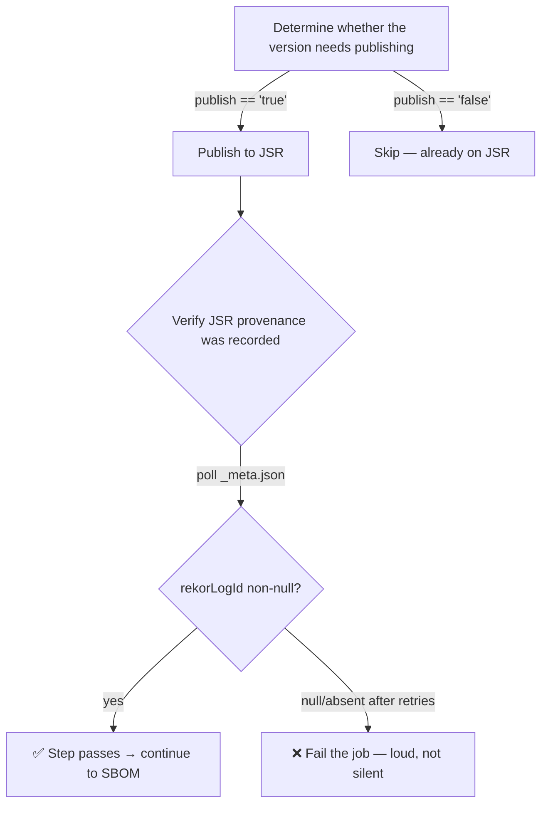

# Fail loudly when a JSR release has no provenance (Issue #3334)

## Summary

The publish pipeline silently succeeded while producing **no** provenance
attestation for v5.8.1 (`rekorLogId` null on JSR). Parent #3332 requires this
failure mode to be **loud, not silent**: a release that publishes without
provenance must fail the CI job, not pass quietly.

This adds a post-publish guardrail — independent of the root-cause fix — that
protects against any future attestation regression regardless of cause:

- **`scripts/verify_jsr_provenance.sh`** — polls
  `https://jsr.io/<name>/<version>_meta.json` for the just-published version and
  exits non-zero when `rekorLogId` is null/absent, emitting an actionable error
  naming the version and the missing attestation. It reuses the
  `jq -r .name/.version deno.json` extraction pattern already in the workflow,
  and applies a bounded retry/poll (tunable via `VERIFY_JSR_MAX_ATTEMPTS` /
  `VERIFY_JSR_RETRY_DELAY`) to absorb JSR eventual consistency without becoming
  flaky — it still ultimately fails if provenance never appears. Per the
  fail-loud principle, a fetch failure is never masked as a valid empty result.
- **`.github/workflows/publish.yml`** — a new "Verify JSR provenance was
  recorded" step runs `./scripts/verify_jsr_provenance.sh`, gated on
  `steps.needs_publish.outputs.publish == 'true'` so it is skipped on runs where
  nothing was published and does not weaken the existing concurrency / version
  gate (#2842, #2904).

CI/publish-pipeline only — no runtime code changes.

Closes #3334.

## Evidence

Backend/CI change — no web interface to screenshot. Verified by driving the real
script against local meta fixtures and by parsing the committed workflow YAML
(see Test Plan). All new tests pass; `./quality.sh --lint-only` is clean
(format, lint, bash syntax including the new script).

## Test Plan

- `test/scripts/VerifyJsrProvenance.ts` — drives the script end-to-end:
  - passes when `rekorLogId` is a non-null value,
  - fails loudly (exit 1, actionable message naming the version) when
    `rekorLogId` is explicitly `null`, when it is absent, and when the meta
    document cannot be fetched,
  - `--help` and unknown-option handling.
- `test/ci/PublishProvenanceGate.ts` — parses `publish.yml` and asserts the
  verification step is present and gated on
  `steps.needs_publish.outputs.publish == 'true'`, guarding against the gate
  itself being deleted or its `if:` guard broken.
- `test/scripts/ShellcheckLint.ts` (existing) — the new script passes
  `shellcheck --severity=warning`.
