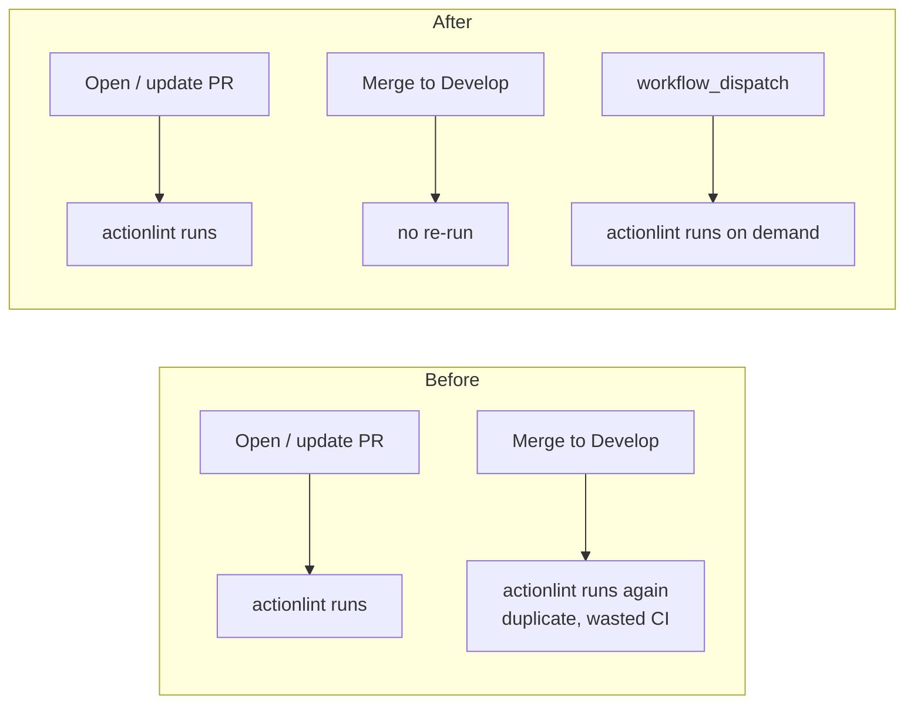

## Summary

`.github/workflows/actionlint.yml` is a **checker** (it lints workflow files),
not a deploy/publish/release workflow. It was triggering on `push` to the
default branch (`Develop`, plus `main`/`master`), so every merge into `Develop`
re-ran the exact lint that had already gated the pull request. That duplicate
post-merge run wasted CI minutes and could leave a red tick on `Develop` for a
check that already passed on the PR.

The fix drops the `push:` trigger and keeps the PR gate, adding
`workflow_dispatch` so the linter can still be run manually. Deploy/release
workflows (`publish.yml`, `github-release.yml`) are intentionally left firing on
push — only the checker changes. Closes #3347.

### Trigger change



`on:` block after the change:

```yaml
on:
  pull_request:
    branches: ["*"]
  workflow_dispatch:
```

## Evidence

Backend/CI-config change — no web interface to screenshot. Verified via the
`test/ci/ActionlintWorkflow.ts` suite, which parses the workflow YAML and
asserts its shape:

```
running 5 tests from ./test/ci/ActionlintWorkflow.ts
actionlint workflow file exists (Issue #2762) ... ok
actionlint workflow triggers on pull_request but not push (Issue #3347) ... ok
actionlint workflow declares read-only contents permission (Issue #2762) ... ok
actionlint workflow invokes the actionlint linter (Issue #2762) ... ok
actionlint workflow checks out the repository before linting (Issue #2762) ... ok
ok | 5 passed | 0 failed
```

Full `test/ci/` suite: `133 passed | 0 failed`. In particular
`WorkflowConcurrencyGroup.ts` (which still lists `actionlint.yml` as a
PR-triggered, pile-up-prone workflow) continues to pass because the
`concurrency:` block is unchanged.

## Test Plan

- Updated `test/ci/ActionlintWorkflow.ts`: the trigger test now asserts the
  workflow triggers on `pull_request` but **not** on `push` (renamed to
  "actionlint workflow triggers on pull_request but not push (Issue #3347)").
  This is a deliberate business-logic change — the old test asserted `push` was
  present, which is exactly the behaviour the issue asks to remove. Against the
  pre-fix workflow the updated assertion fails; against the fixed workflow it
  passes, so it acts as a regression test.
- Ran `deno fmt`, `deno lint`, and `deno check` on the changed test file — all
  clean.
