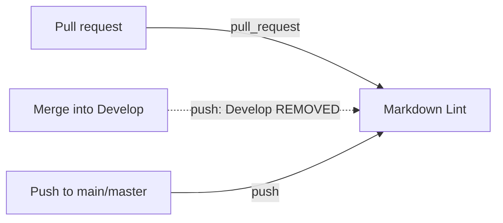

# Stop the Markdown Lint checker re-running on push to `Develop`

## Summary

The Markdown Lint workflow (`.github/workflows/markdown-lint.yml`) is a
test/lint **checker** — it gates the pull request. It still triggered on `push:`
to the default branch `Develop`, so every merge into `Develop` re-ran a lint
that had already passed on the PR. That duplicate post-merge run wastes CI
minutes and can leave a red tick on the default branch for a check that already
passed.

This change drops `Develop` from the workflow's `push.branches` filter, keeping
the `pull_request` trigger (the PR gate) and the `main`/`master` push triggers
(so direct pushes to non-default branches are still linted). Deploy/publish
workflows are untouched — they must keep firing on push to the default branch.

Closes #3348.

## Evidence

Backend/CI-config change only — there is no web interface to screenshot.
Verified via a new "what" test that parses the committed workflow YAML and
asserts on the resulting trigger configuration.



Before → after `on:` block:

```yaml
# before
on:
  pull_request:
    branches: ["*"]
  push:
    branches: [Develop, main, master]

# after
on:
  pull_request:
    branches: ["*"]
  push:
    branches: [main, master]
```

## Test Plan

- Added `test/ci/CheckerWorkflowNoDefaultBranchPush.ts`, which parses
  `markdown-lint.yml` and asserts its `push.branches` filter excludes the
  default branch `Develop` (and rejects catch-all globs that would match it).
  This fails against the unfixed workflow and passes after the fix.
- Confirmed `test/ci/WorkflowConcurrencyGroup.ts` still passes — the
  `concurrency:` hardening from Issue #2842 is unaffected.
- Ran `./quality.sh` and confirmed a clean pass.
