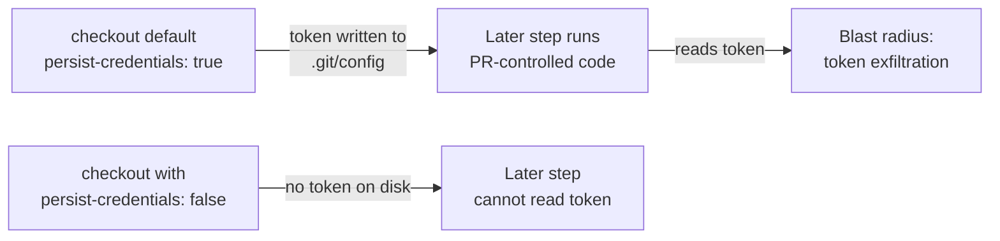

# Harden bench smoke checkout — `persist-credentials: false`

## Summary

The `smoke` job in `.github/workflows/bench.yaml` ran `actions/checkout` without
`persist-credentials: false`. By default checkout writes the workflow's
`GITHUB_TOKEN` into `.git/config` as an auth header, where any later step in the
job — including a compromised dependency or an injected script (e.g. the
subsequent `./build.sh --verify-only`) — can read it and act as the token. The
job only reads the repo and uploads an artifact; it never pushes back or fetches
private submodules, so the persisted credential is unnecessary and only widens
the blast radius of a compromised step.

Added `persist-credentials: false` to the checkout so the token is never written
to disk, plus a regression test guarding the behaviour. Closes #3349.

## Evidence

Backend/CI-config change only — no web interface to screenshot.

- `actionlint .github/workflows/bench.yaml` → OK.
- TDD confirmation: the new test fails against the unfixed workflow and passes
  after the fix:
  - Before fix: `bench.yaml smoke checkout ... FAILED` (persist-credentials was
    `undefined`, expected `false`).
  - After fix: `5 passed | 0 failed`.
- Full `./quality.sh` passed cleanly: `ok | 7627 passed (5 steps) | 0 failed`.

## Test Plan

- Added `test/ci/WorkflowPersistCredentialsFalse.ts` test
  `.github/workflows/bench.yaml smoke checkout must set persist-credentials:
  false (Issue #3349)`
  — parses the workflow YAML and asserts every `actions/checkout` step sets
  `persist-credentials: false`.
- Verified the test reproduces the finding (fails before the workflow edit,
  passes after).
- Existing Issue #2727 persist-credentials tests continue to pass unchanged.
