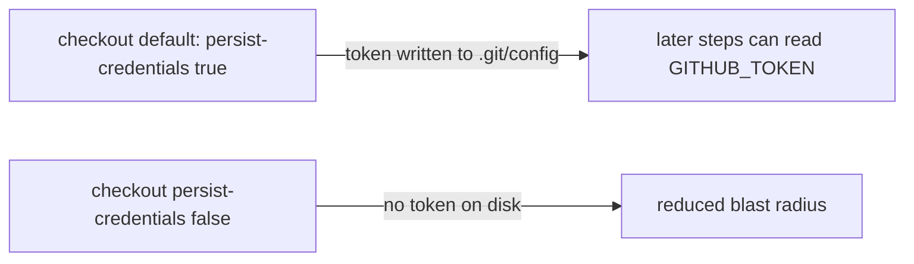

## Summary

Hardened the `coverage` job's checkout in `.github/workflows/coverage.yaml` by
adding `persist-credentials: false` to its `actions/checkout` step (line 57).

By default `actions/checkout` writes the workflow `GITHUB_TOKEN` into
`.git/config` as an auth header, where any later step in the job — including a
compromised dependency or injected script — can read it and act as the token.
The coverage shard only reads the repo, runs the test suite, and uploads an
artifact; it never pushes back to the repository or fetches private submodules,
so the persisted credential is unnecessary and only widens the blast radius of a
compromised step. This matches the established pattern already applied across
the repo (`bench.yaml`, `quality.yml`, `pages.yml`, `osv-scan.yml`,
`actionlint.yml`, `update-package-version.yml`).

Closes #3350.

## Evidence

Pure CI workflow-config change — no web interface to screenshot and no runtime
code to unit-test, so TDD does not apply. Validated with `actionlint`, the
repo's own GitHub Actions linter (also run as the `actionlint.yml` gate):

```
$ actionlint .github/workflows/coverage.yaml
ACTIONLINT_OK
```

Change applied to the checkout step:



Scope note: the finding targets the `coverage` job step 0
(`BP-PERSIST-CREDS-coverage-coverage-0`); only that checkout was modified.

## Test Plan

- `actionlint .github/workflows/coverage.yaml` — passes (workflow YAML remains
  valid after the change).
- No unit tests added: the change is declarative CI config with no callable
  function to exercise.
