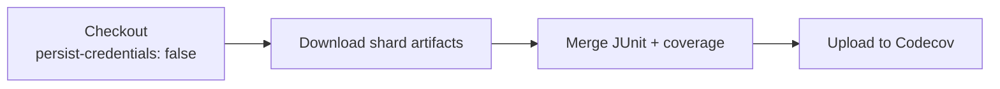

## Summary

The coverage workflow's `merge` job checked out the repo with `actions/checkout`
at its default `persist-credentials: true`, writing the workflow `GITHUB_TOKEN`
into `.git/config` as an auth header for the rest of the job. That job only
reads the repo, downloads shard artifacts, merges the partial coverage + JUnit
reports, and uploads them to Codecov — it never pushes back or fetches private
submodules, so the persisted credential is unnecessary and only widens the blast
radius of a compromised step.

Added `persist-credentials: false` to the `merge` job's checkout step in
`.github/workflows/coverage.yaml`, matching the fix already applied to the
sibling `coverage` shard job (Issue #3350). Closes #3351.

## Evidence

Backend/CI-only change — no web interface to screenshot. Verified via the CI
guard test, which fails against the unfixed workflow and passes after the fix.

```
.github/workflows/coverage.yaml merge-job checkout must set persist-credentials: false (Issue #3351) ... ok
ok | 7 passed | 0 failed
```

Data flow of the `merge` job (read-only, no push-back — so no persisted
credential is needed):



## Test Plan

- Added `test/ci/WorkflowPersistCredentialsFalse.ts` →
  `.github/workflows/coverage.yaml merge-job checkout must set persist-credentials: false (Issue #3351)`,
  which parses the workflow, isolates the `merge` job, and asserts every
  `actions/checkout` step sets `persist-credentials: false`. This reproduces the
  finding (fails before the fix) and confirms the fix.
- Re-ran the full `WorkflowPersistCredentialsFalse.ts` suite (7 passed) plus
  `ActionlintWorkflow.ts` and `WorkflowActionPinning.ts` (12 passed) to confirm
  the workflow still lints and every action stays SHA-pinned.
